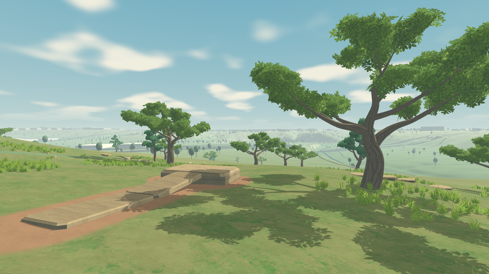
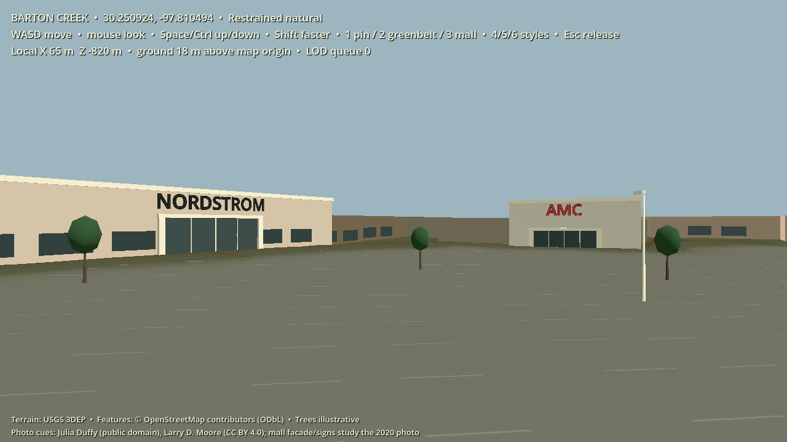

# EnFractal
A limitless shared world

## The world we are building

The [world and creation vision](docs/WORLD-VISION.md) is the project's stated long-term direction: a geographically grounded, cozy 3D Earth with natural proportions, softly sculpted forms, painterly materials and gentle lighting. Players should be able to explore recognizable places at walking height and change them through structured, persistent parts. A shared construction and visual system should make new player and AI-assisted work belong in its local environment without erasing regional character. The MVP proves this in a bounded area and creation vocabulary before broader Earth coverage or more ambitious transformations.

## MVP planning

The [MVP roadmap](docs/roadmap/ROADMAP.md) describes the proposed shared Earth, sandbox worlds, creation system, technical architecture, validation gates, and operating budget. The [execution backlog](docs/roadmap/BACKLOG.md) breaks the work into agent-sized tasks. The [comparable-projects research](docs/roadmap/research/12-comparables-and-layer-practices.md) tests lessons from existing projects against each MVP layer; detailed workstream research is linked from the roadmap.

The [first phases 0–1 checkpoint](docs/engine/checkpoints/phase0-1.md) records what has been built, independent 1–10 ratings, and the remaining gates. Its first-pass median is 4.90/10, below the 8.5 target; the current local build is an engineering fixture rather than an accepted MVP milestone.

The [follow-up build evidence](docs/engine/checkpoints/followup-0-2.md) covers bounded terrain residency, a cross-language spatial pin, art in the playable workshop, and a two-client authority loopback. Each has a targeted review; the phase gates remain open.

## First playable engine slice

The [manual invention checkpoint](docs/engine/checkpoints/manual-invention.md) implements the **main roadmap's Phase 3 local creation loop**: edit parts and behavior graphs, test privately, place or equip an invention, use it, reopen/revise it and reload the saved world. Launch [`run-invention-workshop.ps1`](run-invention-workshop.ps1). **B** builds; **F/V** use/revise nearby ground inventions; **E/Q** use/revise the worn design; **C** allows or stops effects; **H** changes camera. Five starter designs share one compiler, permission service and capability interpreter. Remote multiplayer and the visual-quality gate remain open.

The [ART-0–3 implementation checkpoint](docs/engine/checkpoints/art0-3.md) adds corrected terrain lighting, original editable oak/juniper assets, painted materials, and a composed playable workshop. Launch it with [`run-painterly-patch.ps1`](run-painterly-patch.ps1). All 15 engine checks pass; independent art reviewers score the current standard views **6/10**, so the **8.5 visual gate remains open**. The report includes actual Godot views, a walk-through, low-profile evidence and the remaining visual work.

The [Barton Creek map and local workshop](maps/barton_creek/README.md) are the first implementation, centered at **30.250924, -97.810494** near Barton Creek Square and the MoPac / Highway 360 area. A reproducible source-to-package builder provides sampled USGS terrain, mapped OSM roads, trails, creeks and building footprints, plus illustrative vegetation. A [photo-informed pilot](maps/barton_creek/photo_pilot/README.md) adds color and simplified detail at one Greenbelt segment and the mall west side.

The [first base-engine slice](docs/engine/first-slice.md) adds a validated read-only map runtime, terrain collision streaming, temporary first-person walking/jump/glide/recovery, and a local semantic workshop. A [path now connects to the editable platform](docs/engine/phase1/structured-workshop.md), regenerates its walkable join when moved, and survives save/reload. Open the map with [`run-map.ps1`](run-map.ps1), press **1** then **Tab** to walk in the test workshop, and use **P/E/J/K/O** for the platform and path. Run the engine checks with [`run-engine-tests.ps1`](run-engine-tests.ps1). This is a local engineering fixture, not the shared Home Earth, multiplayer, AI creation or a portal system. The grounded painterly 3D look is the confirmed direction; the current [walking-height art reference](docs/engine/phase1/art-reference.md) remains a blockout below the final quality target.

The [Greenbelt visual style study](docs/greenbelt-style-study.md) applies three editable looks to the same small scene. Run [`run-style-study.ps1`](run-style-study.ps1) to compare them in Godot with keys **4**, **5**, and **6**.
