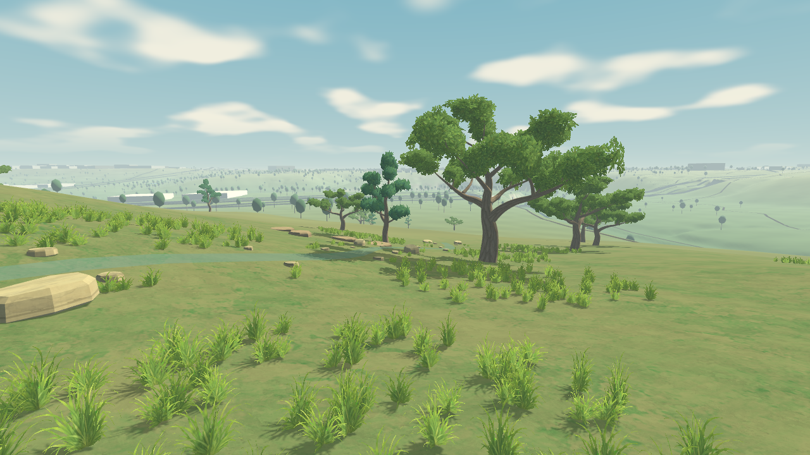
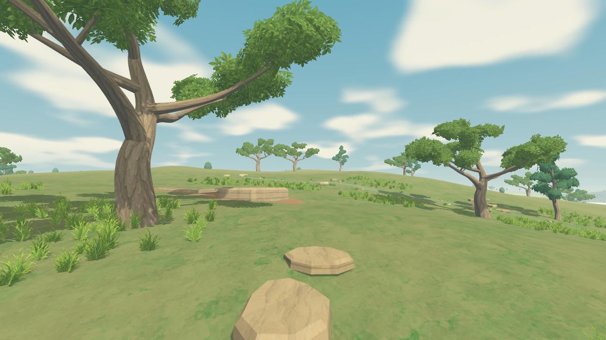
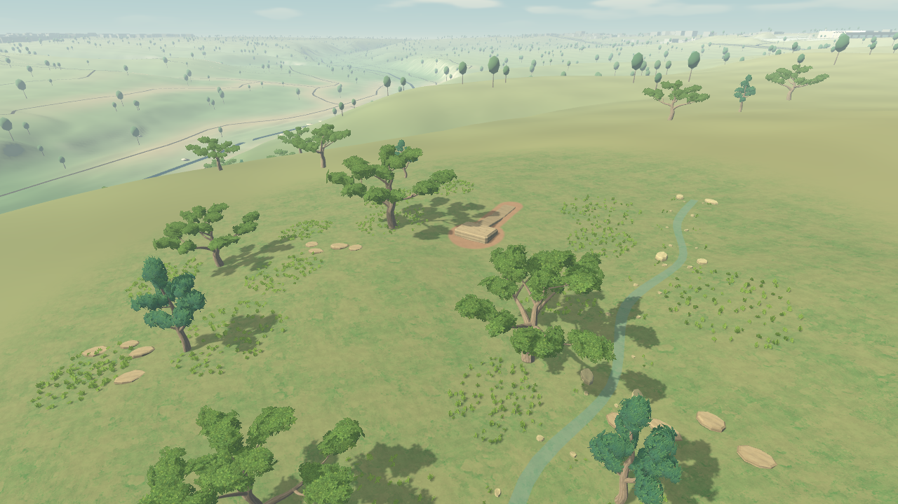

# ART-0–3: painterly pipeline implementation checkpoint

The revised art roadmap now has a working implementation through ART-3: repaired terrain lighting, original editable tree sources, shared painted materials, and a small playable composition in the existing Barton Creek workshop. **The visual acceptance gate remains open.** Two independent reviewers rated the final standard views **6.0/10**, below the unchanged **8.5** target; the low-profile review was **5.8/10**.

This is the ART-0–3 sequence in the [pipeline diagnosis](../../roadmap/research/13-painterly-pipeline-diagnosis.md), not completion of phases 0–3 of the full shared-world MVP roadmap. Multiplayer, AI creation and portals are not delivered by this art checkpoint.

## Play the result

From the repository root, run:

```powershell
.\run-painterly-patch.ps1
```

The launcher prepares missing or changed art imports and opens the actual map/workshop at walking height. Use **WASD** and the mouse to walk/look; **P** places a platform, **J** adds its path, **K** changes the endpoint, **E** resizes the selected platform, and **O** reloads the saved workshop. **Tab** switches walking/flying. Existing local saves remain in use during normal play; the evidence scripts use isolated test saves.

The low profile can be selected before launching:

```powershell
$env:ENFRACTAL_ART_PROFILE = 'low'
.\run-painterly-patch.ps1
```

Remove that environment variable to return to standard. The launcher restores its own style/view/start-walking variables after it closes.

## Actual Godot evidence

These are unretouched Godot 4.7.2 Compatibility captures, not image-model previews. The three walking cameras use a 1.67 m eye height. The construction view is deliberately higher so incomplete environment relationships remain visible.








The [walk-through video](../../videos/art3-walkthrough.mp4) records the real player controller moving about 10.7 m and then turning. All 210 recorded frames reported grounded contact. Its 30 fps encoding rate is a presentation choice: screenshot readback changes execution timing, so this is **not a frame-rate benchmark**.

Compare the [same-camera scene before the edit](../../images/art3-standard-before.png) and [after reload](../../images/art3-standard-reloaded.png). The final edited/reloaded PNGs are byte-identical (SHA-256 `d017124fd609ff72219edc9b1b4c7685ffcedc5b25314a98108099ca648f0821`). The semantic state retains revision 3 and the same generated join identity.

## What was built

| Packet | Implementation and evidence | Acceptance status |
|---|---|---|
| ART-0 | Correct clockwise faces for main terrain and affected reference geometry; explicit backface culling; neutral-light controls; unchanged source heights and collision. [Calibration report](../phase1/art0-renderer-calibration.md). | Rendering checks pass. |
| ART-1 | Original Blender oak/juniper sources, branching controls, canopy guides, shared painted foliage/bark, exported UVs and shading normals. Eight-angle, walking, warm-light and distant Godot captures. [Asset library](../phase1/painterly-asset-library.md). | Editable assets delivered; “one excellent oak” visual gate remains open. |
| ART-2 | Painted ground/limestone materials, clustered cutout grass, embedded stones, geographic material blending and contact soil driven by semantic edits. | Material implementation delivered; visual finish remains below target. |
| ART-3 | Nine-tree central study with understory, stones, a planted illustrative rain garden, editable platform/path/join, three walking views, construction view, walk-through and save/reload proof. | Playable integration delivered; composition, creek-bank quality and overall art gate remain open. |

The terrain remains the pinned USGS height grid. The tree plantings, limestone dressing and **seasonal rain garden are illustrations**, not surveyed individuals or a reconstruction of mapped Barton Creek. The central composition spans roughly 30 m, the terrain material blends out to a 35 m radius, and 30 nearby representative tree points within a bounded 145 m surround now use the authored assets. The remaining larger map still contains its older simplified proxies.

Construction remains structured. Platforms, paths and generated joins retain their existing identities, validation and collision. Painted materials are attached to those parts, and soil contact masks refresh when a part changes or reloads. A separately validated platform at local `(48,350)` also retains its soil contact **outside** the 35 m art radius: the rendered enabled/disabled control differs at 30,660 pixels. See the [contact evidence](../../images/art3-outside-contact.png) and [disabled control](../../images/art3-outside-contact-control.png).

## Verification and independent review

All **15 checks** in `run-engine-tests.ps1` pass: map loading, terrain seams, streaming/residency, loading input, world state, creation operations, movement, world physics, path/platform joins, workshop integration, art fixtures, and the new geometry regression. The geometry regression covers 167,717 triangles and uses stock Godot geometry as its convention control. The new rain-garden test checks every water triangle against that same clockwise convention.

The import helper was tested with a fresh minimal project, an unchanged second run, changes only to PNG/GLB import settings, formatting-only changes, and timestamp-only changes. It records normalized import settings locally so an existing checkout cannot silently retain outdated mipmap or size settings. Fresh imports and rendered captures finish without stderr errors.

Two independent art reviewers inspected the final standard arrival, bank, under-oak and construction views. Both gave **6.0/10**, excluding engineering/test credit. One also compared the low profile and gave **5.8/10**: major silhouettes and composition survive, but thinner groundcover exposes more bare terrain. The earlier review of this implementation was 5.5/10; the subsequent architecture/material revision improved it, but did not meet acceptance.

The remaining visual priorities are:

1. Connect understory, soil and limestone into a believable habitat. Broad empty slopes and isolated tufts still read as a test field.
2. Build a convincing bank/water/rock relationship. The present rain garden remains a thin surface ribbon rather than a finished creek environment.
3. Improve regional depth and material hierarchy, including the remaining distant proxy trees, pale atmosphere and coarse branch junctions.

No motion/shimmer score is inferred from still images. The video is available for that review. A higher agent score cannot replace the founder's visual acceptance.

## Limits and next gate

| Current setting | Standard | Low |
|---|---:|---:|
| Central trees | 9 | 9 |
| Central dressing triangle upper bound | 106,446 | 102,414 |
| Main groundcover cards | 3,264 | 1,344 |
| Bank grass cards | 144 | 48 |
| Sun shadow reach | 52 m | 34 m |
| MSAA | 4× | 2× |

These counts exclude terrain, buildings and the 30 authored surrounding trees. They are scope counts, not performance results. Both profiles retain the same full tree meshes; automatic tree simplification is disabled until an actual LOD comparison exists. The low profile therefore makes only modest geometry savings.

Capture hardware was an **NVIDIA GeForce RTX 2070 Super**, not the founder's limited laptop. The standard capture reported about **50.7 MiB total renderer texture memory at that point**, including map and other resources; this is neither the six-texture library cost nor a peak measurement. [Standard metadata](../phase1/art3-standard-capture.json) and [low metadata](../phase1/art3-low-capture.json) record the device, settings, map hash, edit state and counts. No laptop frame-rate or memory target is claimed.

ART-4 still requires named-device timing, memory, dense foliage and motion tests, and actual lower-cost tree representations. ART-5 remains gated on visual acceptance. Same-build visual reload is proven; cross-version graphic reproduction is not: current saves still pin the older style recipe rather than a complete hash of this new rendering bundle. That render-bundle pin and migration policy remain explicit follow-up work.

Stop broader world-art expansion at this checkpoint. Complete the visual relationships above before propagating this vocabulary across the larger map.

## Reproduce the evidence

Use Godot 4.7.2 with the project's imported assets. Windows launch/test wrappers locate the existing executable or respect `ENFRACTAL_GODOT`.

```powershell
.\run-engine-tests.ps1
$env:ENFRACTAL_ART_OUTPUT = 'D:/Enfractal/.cache/review-art3'
# Substitute the installed Godot executable when necessary.
& .cache/godot/Godot_v4.7.2-stable_win64.exe --path game --script res://tests/painterly_patch_capture.gd
```

Set `ENFRACTAL_ART_WALK_VIDEO=1` to save the walk's numbered PNG frames. `painterly_asset_capture.gd` produces the isolated tree views. Captures require a graphics context; headless test results cannot establish appearance. The committed MP4 encodes those actual frame images with H.264; it is not a generated animation.
