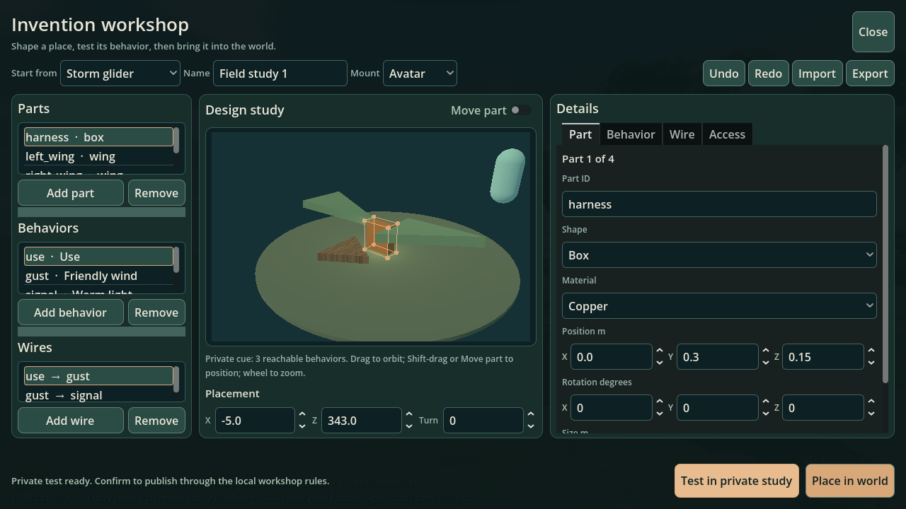
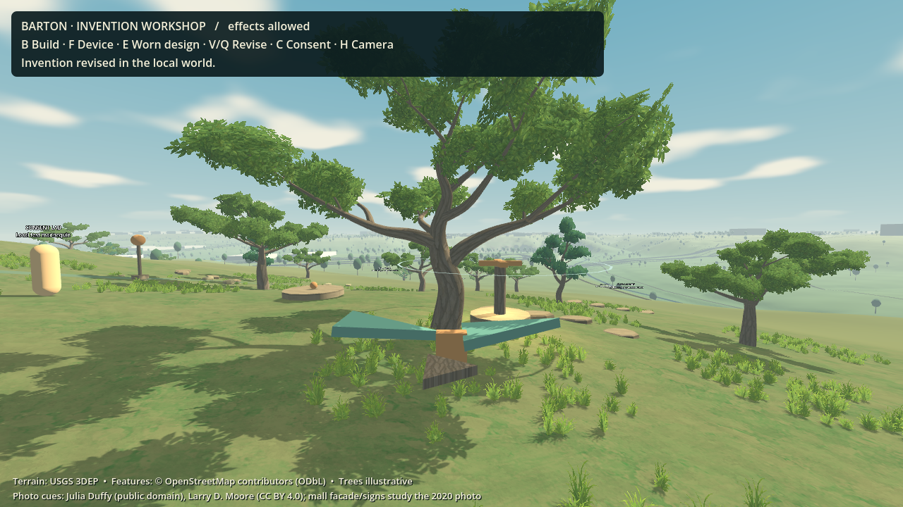

# Manual invention: playable local checkpoint

**2 October 2026 — main roadmap Phase 3, E11–E14.** This is the general manual creation system in the actual Barton Creek map. The earlier ART-0–3 checkpoint was an art workstream; it was not this milestone. The new implementation supports source editing, contained previews, host-owned permission checks, placement/equipment, live behaviors, revision and reload without AI or a hosted service.

## Try the loop

Run [`run-invention-workshop.ps1`](../../../run-invention-workshop.ps1) from the repository. It opens the actual Barton map at walking height. Normal play uses its own local invention save and preserves the older path/platform workshop save.

1. Press **B**. Start with **Updraft totem**, **Rescue pad**, **Sensor lantern**, **Spinner**, or the wearable **Storm glider**. Blank designs use exactly the same compiler.
2. Select a part to change its shape, material, position, rotation or size. A copper guide identifies the selected part. **Shift-drag** or turn on **Move part** to move it horizontally in the study; height, rotation and size also have numeric controls. Ordinary dragging orbits and the wheel zooms. Add typed behaviors and connect their wires. Wind vectors have a **Normalize** action. Draft Undo/Redo never rolls back another world edit. Import/Export exchanges portable JSON source. Closing an unfinished new draft keeps it for this local session.
3. Choose **Test in private study**. Test checks permissions, protected areas, capacity and live-player clearance without changing the world. The separate scene shows reachable behavior cues with a simulated consenting dummy; these are a bounded illustration rather than a substitute for collision testing in the world. Confirm **Place in world** or the revision action to publish. Confirmation repeats the host checks against the current world.
4. Press **C** to explicitly allow invention effects. Consent starts off and resets off after loading. Approach a ground invention and press **F** to use it; **E** uses the worn design. Timers and proximity sensors operate through the same capabilities. **H** switches to a camera that shows your equipped assembly.
5. Press **V** near a ground invention, or **Q** for the worn design, to reopen its source. Change it, test, and confirm. Accepted edits save automatically. Restarting recompiles saved source; invalid or incompatible saves fail closed.

**WASD** walks, mouse looks, **Space** jumps/holds the existing glide movement, **Shift** runs, **R** recovers, **Tab** changes walking/flying, and **Escape** closes the editor or releases the mouse. Invention effects are additional approved movement capabilities. Ordinary movement remains available when consent is off. Legacy P/E/J/K/O editing shortcuts are disabled in this launcher.

## What is implemented

| Packet | Concrete result |
|---|---|
| E11 — general compiler | One data-only schema, shared vocabulary and parameter registry; strict errors; canonical source/hash; deterministic acyclic execution; component costs; full rotated and rotor-swept bounds. Box, ellipsoid, elliptical cylinder, wing and rotor parts use shared material families. |
| E12 — editor | Editable parts, behavior nodes, wires, draft history, source import/export, isolated preview, explicit placement/revision confirmation, reopening/removal, stale-view rejection and input isolation. The study executes the same graph traversal as the live interpreter. |
| E13 — permission boundary | Host-assigned identity/ownership/height/cost; owner/editor/visitor roles; explicit per-target consent; protected garden; live-avatar clearance; per-design, per-actor and world budgets; principal-bound retry receipts; pinned atomic local saves. The labeled mannequin demonstrates consent locally. |
| E14 — creative loop | Five source recipes combine interact/timer/proximity triggers with bounded wind, spin, warm light and passive glide. No runtime behavior branches on recipe names. Create → test → place/equip → use → revise → reload runs on the actual map. |

The host admits at most 8 creations per owner and 16 in this world, 24 parts/16 behavior nodes/32 wires per source, and 16 simultaneous wind fields. Sources are capped at 32 KiB. The authority also caps component totals, trigger rates, field admissions and node evaluations. Fields last at most two seconds; rotor/light effects last at most five. Replacement releases previous reservations. Manual previews do not reserve live-world capacity.

The construction interpreter applies wind explicitly to the player controller. Friendly upward wind includes weight support as a game rule, not a fluid-dynamics claim. Contribution tracking, contact projection and recovery checks prevent a revoked force or protected-boundary recovery from carrying the player into prohibited space. Rotor animation has no rigid-body pushing collider. New dynamic bodies, unrestricted joints and cross-object event chains require separate capability work.

## Verification and review

Reproduce with [`run-engine-tests.ps1`](../../../run-engine-tests.ps1). The added checks cover compiler acceptance/rejection, authority commands and persistence, actual mesh extents/winding, real CharacterBody motion, editor behavior, and the complete map/editor loop. The map test uses a separate temporary save. In graphical mode it also writes the two screenshots above; it clicks the visible Test/Confirm controls and routes use/revise shortcuts through the input system. Headless mode routes those events directly into the viewport.

Independent reviews caught and drove fixes for swept rotor bounds, stale runtime artifacts, combined wind/glide velocity bookkeeping, protected recovery, preview lifecycle, inaccessible footer controls, low-contrast selections and wearable target selection. The final independent local checkpoint review rated this implementation **8.6/10** (functionality/correctness 8.9, editor/player experience 8.3), after checking the rendered editor, direct dragging, shared read-only placement validation, and independently rerunning the authority and editor checks. The technical authority/runtime integration review rated its bounded scope **8.5/10**. The compiler/geometry review rated its scope **8.6/10**, with the compiler portion explicitly identified as self-review. These are scoped agent assessments, not a whole-game, visual-quality or player-study score.

The final integration freeze passes **21/21 engine suites**, including all 15 preceding terrain, movement, join, persistence and art regressions. The six new suites report:

| Check | Final result |
|---|---|
| Compiler | 16 valid and 45 invalid fixtures; clean stderr |
| Authority | 167 checks, zero failures; includes read-only placement validation and confirmation revalidation |
| Generated geometry/execution | 20 assemblies; 9,416 actual bounds corners; 3,056 outward triangles; live rotor sweep, graph deduplication and timer checks |
| Live runtime/physics | 67 checks, zero failures |
| Editor | 39 checks, zero failures; includes 900 × 600 footer visibility, selection/orbit, direct dragging, draft recovery and preview cleanup |
| Actual map/editor loop | 76 checks, zero failures in headless, standard graphical and low graphical runs |

The graphical runs use Godot 4.7.2 Compatibility on the development RTX 2070 Super. [Low-profile editor](../../images/manual-invention-editor-low.png) and [low-profile play](../../images/manual-invention-play-low.png) are additional actual-engine captures. This confirms functionality in both profiles; it does not certify frame time or memory on the target laptop. The map test checks visible mouse targets, mouse-driven part dragging and Undo, protected-placement rejection before confirmation, F/V and E/Q input routing, use distance/wearer permissions, consent, revised source reload and spawning around existing inventions.

## Remaining roadmap gates

This local implementation does **not** close the earlier E09/E10 remote multiplayer, real-account identity, continuous network simulation or hosted crash-durability gates. The guest is a labeled local mannequin. A future network adapter must authenticate principals outside request bodies and execute this compiler/authority/interpreter on the host.

The existing path/platform relationship fixture remains independently tested and preserved; it is not yet editable through this general invention editor. The Storm glider is a functional movement composition, not finished dragon character art. General neighborhood reconstruction, free rigid-body joints, AI/MCP player creation, Home Earth partitioning, portals and subscriptions remain later work. The grounded painterly direction remains in force, while the separate visual gate is still below 8.5 and the target 8 GiB integrated-graphics laptop has not been certified. The playable build requires no hosting or paid player-inference service.

Implementation detail: [contract](../phase3/manual-invention-contract.md), [compiler](../phase3/compiler.md), [authority](../phase3/authority.md), [editor](../phase3/editor.md), and [primary-source research](../phase3/research.md).
