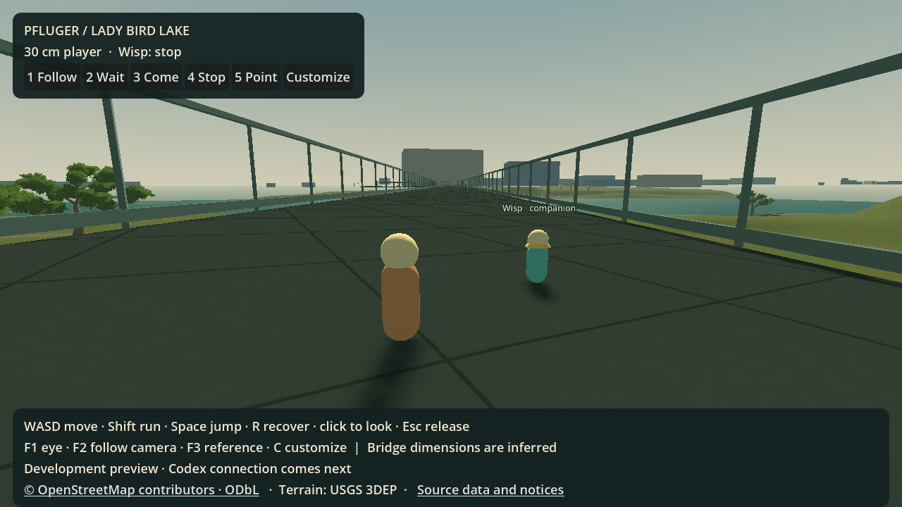
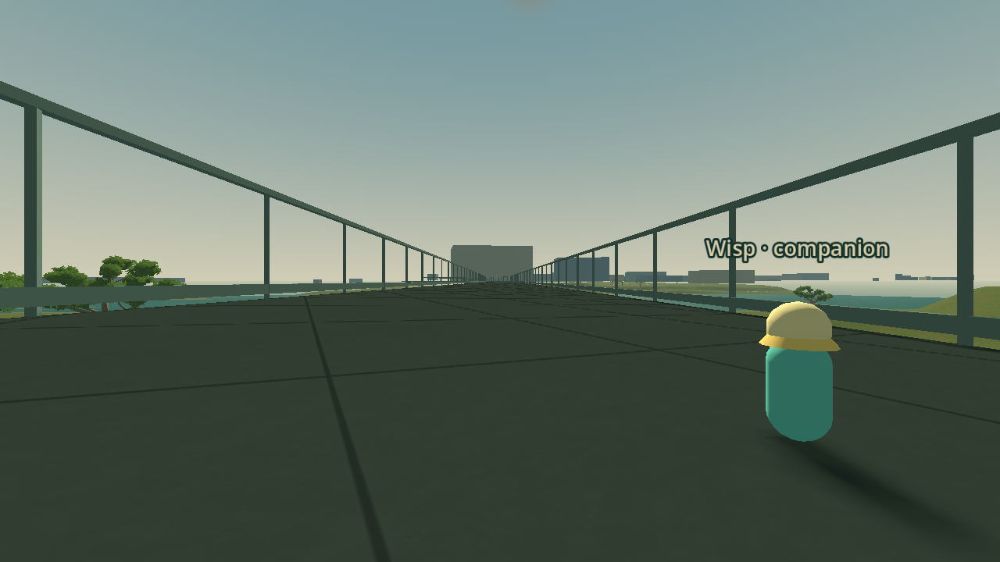
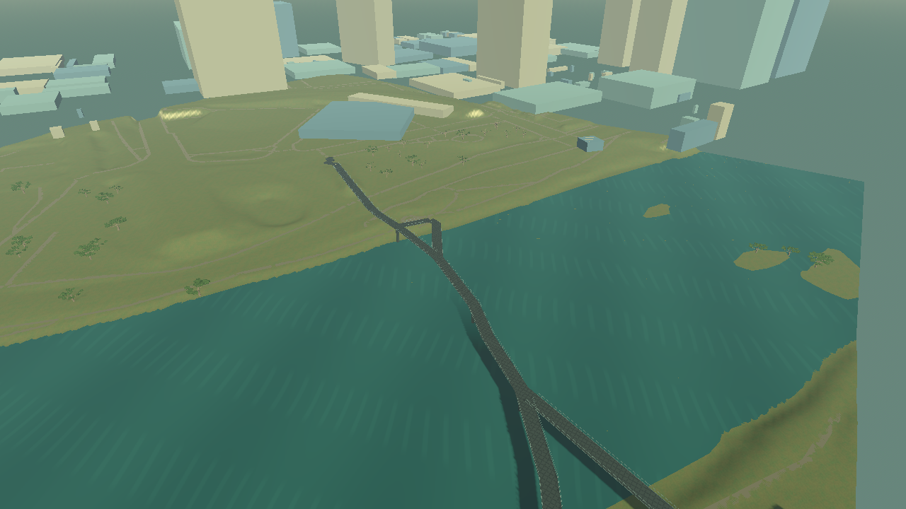

# S1 engineering checkpoint: Pfluger and two small avatars

2 October 2026, following the merged S0 foundation. **The native source/embodiment checkpoint is implemented; the S1 art, geographic-fidelity and device gates remain open.** This is a playable development preview, not acceptance of S2–S6.

## Delivered

Pfluger is the default Godot/native destination. The reproducible [source package](../../../maps/pfluger_district/README.md) traces the founder's named roads into a 3.3517 km² district, with archived USGS terrain and OSM features, source hashes, rights and a 150 m north-approach route. Building and vegetation coverage, lake islands, the small western boundary connector and unresolved elevation metadata are recorded explicitly. Offline rebuilding produces identical package bytes. No third-party photographs were redistributed.

The C# preview renders a bounded 512 × 512 m portion around the landing, with coarse urban context. It reuses the checked GDScript map runtime, terrain collision streamer and original oak art. Terrain collision now retains the union of both avatars' bounded neighbourhoods, so a waiting companion keeps its ground when the player leaves. The legacy one-centre behavior remains available. Bridges and ramps have independent mesh/collision surfaces; the source route is resolved against the actual structural colliders. Lake polygon holes remain open. The inferred flat deck, ramp, guards, building boxes, water level and illustrative tree placement are provisional geometry rather than surveyed reconstruction. The remainder of the district is not a finished explorable map.

The player has a **0.30 m** capsule, 0.26 m eye height, 0.06 m radius, 0.045 m step, 0.90 m/s walk and 1.50 m/s run. Source geography remains in metres. Movement, slopes, stepping, ceilings, recovery and camera clearance use this body profile. The separate companion has a stable local identity, its own appearance/name, bounded following and follow/wait/come/stop/look/point behavior. Deterministic local steering requires no inference; it is not general pathfinding or the real AI companion connection.

Both avatars can be customized. Appearance preferences are saved atomically under the separate `user://single_player/pfluger` namespace. Eye, follow and elevated reference cameras expose scale and context. Customization suspends movement; direct controls resume when it closes. World edits, semantic tree transformations and object protection are not implemented in this preview.

The founder authorized retiring Barton Creek. Native exports exclude its map, and the old launcher now selects it explicitly as a development fixture. Original reusable art, source tooling, compiler, rules, persistence and regression tests remain. Existing application/save-directory identity is preserved; no personal save or PostgreSQL data was deleted. Remaining Barton map bytes can be removed after dependent fixtures migrate.

## Validation

- Source suite: **8/8**, including offline byte-identical rebuilding, corruption/unmanifested-input rejection, district/route geometry and height decoding. Runtime copies match every archived package byte.
- C# build: **0 warnings, 0 errors**.
- Small-avatar fixture: **53/53**, including capsule/visible bounds, steps, slopes and recovery, low ceilings, companion identity/steering and direct Stop.
- Scene fixture: **48/48**. Normal movement reaches all 21 route segments across the full 150 m, with no player or companion recovery teleport and companion separation at most 1.5 m. An independent traversal measured a 1.24 m maximum gap. The endpoint remains supported over water by a structural deck. A separate bare-terrain fixture keeps a stopped companion supported while the player moves over 128 m away, checks recovery and enforces an 18-patch residency maximum.
- Separate rendered capture: **24/24**, on NVIDIA RTX 2070 SUPER with the Compatibility renderer. Capture mode explicitly omits the long route test; the headless fixture provides that proof. Avatar views are taken about 25 m along the route at the north-loop exit, looking toward the next mapped waypoint; gameplay starts at the original route start.
- All **26 retained/native engine checks and suites** pass after the collision-residency extension, including legacy movement, compiler/authority, creation/save adapters and C# interop.
- The self-contained Windows export passes the C# compiler/resource probe and opens the default Pfluger scene from an empty working directory with developer .NET environment/search paths removed. The probe checks that Pfluger is included and Barton map data is absent. The current complete output directory is about **198.55 MiB**, including bundled runtime and credits; this is a local unsigned development artifact, not a clean-device release qualification.

Initial tests found blocked joins, terrain intersecting an inferred deck, a spawn-height mismatch, slow companion catch-up, sloped recovery clearance and movement after Stop. These were corrected and exercised by the expanded traversal/controller tests; success is not based only on short movement or teleporting between route points.

The actual engine views below expose both progress and limitations. No art score, low-device frame-rate claim or geographic acceptance is inferred from them. Mapped context: [© OpenStreetMap contributors, ODbL](https://www.openstreetmap.org/copyright); terrain: USGS 3DEP. The playable HUD displays attribution and source links; native packages include separate credits/data notices.

## Launch and continue

Run `pwsh -NoProfile -File run-pfluger.ps1`; setup and native export are described in [Native build](../../NATIVE-BUILD.md). WASD moves, Shift runs, Space jumps, R recovers, F1/F2/F3 change cameras, C customizes, and 1–5 direct the companion.

The next S1 work is evidence-backed landing/bridge detail, clear terrain/path/bank joins, deliberate vegetation masses, painterly materials and founder review at avatar and reference heights. Public photo coverage/rights, vertical datum and small-scale collision detail remain open. Source `walkability_verified` remains false because prototype traversal does not verify the real bridge.

The locally supplied bridge views are catalogued in the [photo reference audit](s1-pfluger-photo-reference-audit.md). They expose the spiral, branching and layered paths, supports and material rhythms missing from this preview. The image files remain outside the source package and Git while their provenance and reuse rights are unresolved.

S2 begins with a restricted local command boundary. The existing creation authority still has Barton-specific plot bounds, a strict legacy save format and human-avatar runtime assumptions. Those must be adapted with compatibility tests before the companion can edit Pfluger. The selected first client is Codex; [ADR 0002](../decisions/0002-codex-game-profile.md) records the unresolved complete tool-isolation proof. No live AI login, speech or inference occurred, and manual behavior is not presented as real-AI acceptance. S3–S6 and all human/device/release gates remain open; multiplayer stays deferred.
