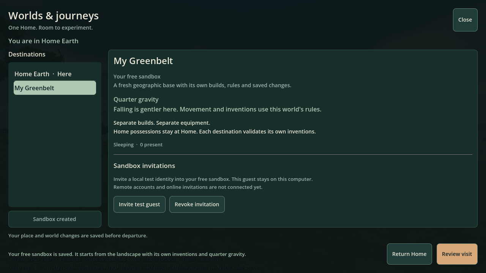
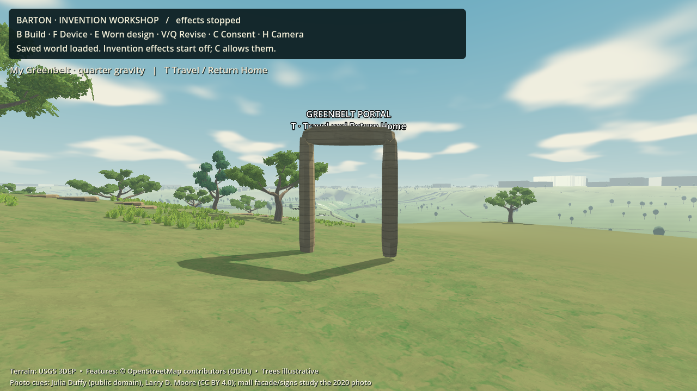

# Phase 4: local save and travel checkpoint

**2 October 2026 — main roadmap Phase 4, E15–E20.** The Barton workshop now connects to an actual PostgreSQL database, keeps Home and sandbox inventions separate, visits a quarter-gravity sandbox, and returns Home through a recoverable transfer. This is a working local checkpoint. Remote accounts/multiplayer, hosted worker orchestration and off-host disaster recovery remain open; the complete Phase 4 exit gate is not certified.

## Try it

The current development machine is prepared. Run [`run-save-travel.ps1`](../../../run-save-travel.ps1). On a fresh Windows checkout, first run `python services/save_travel/setup.py`; this opt-in setup installs pinned dependencies inside the project and starts a loopback-only PostgreSQL cluster. An existing local PostgreSQL installation can also be used; see the [service instructions](../../../services/save_travel/README.md).

1. **B** opens the existing invention editor. Place or revise an invention at Home; success means its database transaction committed.
2. **T** opens **Worlds & journeys**. Create **My Greenbelt**, your free sandbox. Review its quarter-gravity rules and explicitly confirm the visit.
3. The sandbox starts with the same geographic base and authored landscape, with its own empty invention save. Home equipment and creations stay at Home. Build a different invention and try the gentler falling motion.
4. Open **T** anywhere and choose **Return Home**. Home's inventions and normal gravity return. The menu works independently of the decorative stone portal's position.
5. Close and reopen the game. The database remains authoritative; later startup does not replace it with an old local file. Invention effects reset to off after each world load; **C** explicitly allows them again.

The invitation controls issue and revoke a saved invitation for a **local test identity**. They do not yet invite a remote friend. The backend tests exercise that identity's admission, visitor/editor permissions, expiry, revocation and one-use limits. The on-screen consent mannequin remains a separate local fixture.

The first database initialization imports the existing manual invention source from the local workshop. The earlier path/platform fixture remains in its original save and is not imported or rendered in travel worlds. No existing save is deleted. Drafts retained during this game session are scoped to their world; a tested draft or creation ID cannot carry approval into a different world.

[Home after returning](../../images/save-travel-home.png) is a separate actual-engine capture. The portal is an illustrative landmark using the existing painted limestone family, not a live view into a second rendered world.

## What changed

| Workstream | Implemented local behavior | Remaining gate |
|---|---|---|
| E15 — durable state | Versioned PostgreSQL schema; atomic source envelopes and action receipts; map/compiler/style pins; revision checks; reload through the existing Godot compiler; acknowledgement only after commit | Production migrations, independent crash/power-loss qualification and remotely authenticated writers |
| E16 — Home permissions | Canonical Home world; world-qualified creation identity; existing bounded workshop/protected garden; host-supplied roles, ownership and explicit consent | General parcel registry, real accounts and operator moderation workflow |
| E17 — sandbox lifecycle | One saved sandbox per fixture account; base-only fork; independent rules/source; one sandbox admission slot; source reservation retained until teardown acknowledgement; inactive local worlds do not simulate missed ticks | Separate hosted simulation workers, fair queue, population/load certification and process-supervisor teardown evidence |
| E18 — invitations and travel | Persistent recipient/role/expiry/use limits; revalidation at commit; source freeze; one fenced presence; destination activation; menu-level Return Home; source equipment never copied | Real remote visitor UI, destination client tickets and approved blueprint import/adaptation |
| E19 — faults and recovery | Duplicate commands, concurrent saves, stale sessions/hosts, changed rules/invites, unknown commit, interrupted transfers, ledger exhaustion and adapter failures have executable tests | Full network loss/jitter, hosted source/destination process matrix and multiple real clients |
| E20 — backup and restore | Consistent `pg_dump` snapshot plus pinned code/content bundle; corruption checks; restore only into a new isolated database; reproduced source recompilation and receipt/presence recovery | Actual independently stored backup, fresh-machine/off-host restore, retention operation and measured recovery promises |

The control plane is one bounded JSONB document under a PostgreSQL transaction and row lock. This favors inspectable atomic behavior for the tiny local pilot; it is not a scalable planetary database layout. The normal endpoint admits only the trusted local Godot host. Godot still owns creation compilation and gameplay validation. The endpoint is not suitable for untrusted Internet game clients.

The adapter stops input and effects before crossing, replaces the old world's assemblies, then acknowledges arrival. A timeout is an unknown outcome: it does not reactivate the old source or display a successful save. Recovery reads the canonical database outcome. A broken destination scene cannot prevent a fresh service session from requesting Return Home. Periodic status checks fence replaced sessions; critical writes recheck session, world, presence epoch and store revision at the database. This local check is not remote authoritative movement simulation.

Ordinary command quotas reserve bounded space for reconnect, cancellation, arrival and Return Home. Recovery receipts have four replaceable slots per fixture account; they are not an indefinite history. Only the latest local startup receipt is retained. Remote admission still requires a proper authentication/challenge protocol. Detailed bounds and wire contracts are in the [service README](../../../services/save_travel/README.md).

## Verification and independent review

| Evidence | Observed result |
|---|---|
| [`run-engine-tests.ps1`](../../../run-engine-tests.ps1) | **24/24 suites** pass, preserving all 21 preceding checks |
| New durable Godot adapter | **19 checks**: commit acknowledgement, lost response, receipt replay, source validation, fencing and no competing file save |
| Travel UI | **32 checks**, plus inspected 900 × 600 and 1280 × 720 rendered layouts |
| Adapter failure tests | **25 checks**: unavailable startup remains frozen; bad destination still permits Home recovery; stale heartbeat cannot overwrite a newer save; changed authority fails closed |
| PostgreSQL service | **28 tests**, including concurrent retries, full ledgers with safe recovery, host replacement and transfer state boundaries |
| Dependency setup | **5 guard tests**: environment repair, interrupted initialization credentials and refusal to overwrite existing data; no fresh download is performed by these tests |
| Backup/recovery | **24 tests**: 15 archive/destination guards and nine actual PostgreSQL scenarios, including abrupt application exits at every transfer checkpoint |
| Actual Barton game + database + service restart | **32 first-run checks and 24 restart checks**, passing headless and with the GPU renderer, with empty error output |
| Launcher | Clean local database stop/start and service readiness check pass; launcher restores its environment and stops its own service process on exit |

Reproduce the database, restore and actual-map tests with [`run-save-travel-tests.ps1`](../../../run-save-travel-tests.ps1); add `-Capture` for actual-engine screenshots. Tests use newly created isolated databases and test saves. They never reset a personal world. The [restore evidence](../../../tests/save_travel_recovery/evidence.json) records the small-fixture timing and exact source inventory used for that drill; timings do not establish a production recovery objective.

Independent agents rated the **local Godot integration 8.6/10** and **local persistence/travel durability 8.6/10** after identifying and verifying fixes for gravity revisions, stale responses, recovery from an incompatible destination, host fencing and premature sandbox-slot release. These are scoped technical/UX assessments. They do not certify art quality, remote multiplayer, off-host recovery or the intended low-spec laptop. Actual graphical verification used Godot 4.7.2 Compatibility on the development RTX 2070 Super.

## Operating limits

The default local database and matching credentials live in ignored `.cache/postgresql/data` and `.cache/save-travel-config.json`. **These contain saved work, despite the cache directory name. Preserve them and make a verified backup before cleaning that directory.** GitHub contains the application and recovery tooling, not private saves or credentials. The [recovery runbook](../phase4/recovery.md) explains backup, inspection and isolated restoration. A same-disk copy does not protect against losing this laptop.

This checkpoint starts no paid hosting or model inference. Database operations are bounded local control calls; game movement does not use this HTTP API. A local save can briefly wait for its database acknowledgement, and a failed service freezes consequential play until recovery. The target laptop, long sessions and combined hosted capacity still require the roadmap's performance and operations work.

The grounded painterly direction remains unchanged; its separate visual-quality target remains open. Part 5's AI/MCP work is not included in this checkpoint. Earlier remote-identity and replication gates also remain open, so this is not yet the shared online private MVP.

Further detail: [primary-source research](../phase4/research.md), [travel UI contract](../phase4/travel-ui.md), [service and protocol](../../../services/save_travel/README.md), [recovery procedure](../phase4/recovery.md).
