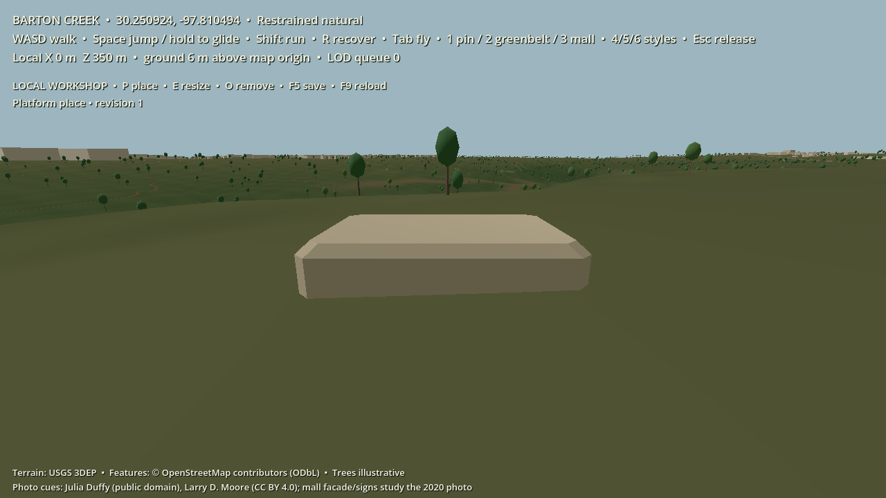

# First base-engine slice: Barton Creek local workshop

**Status:** local engineering fixture, 1 October 2026; integrated checks pass, while export and target-device performance gates remain open. This work touches E01–E05 and an E07 movement subset for the existing map; it does not meet the full MVP gates in the [backlog](../roadmap/BACKLOG.md).

## Decisions for this slice

- **Place and look:** use the licensed Barton Creek package at 30.250924, -97.810494 and the confirmed **grounded painterly 3D** art direction. New objects use the existing material families and remain semantic, editable parts. Source-derived geography stays separate from illustrative and player-created content.
- **Platform:** run on the installed Godot 4.7.2 standard Windows build. GDScript is the provisional implementation language for this small working fixture; the roadmap's Godot/C# production hypothesis remains unconfirmed. The .NET SDK and Godot export templates are not installed on this machine, so a C# and Linux headless export decision remains open.
- **Local world:** use a named test workshop, pinned to the current `barton_creek_v0` base map. The workshop is local developer state, not the canonical shared Home Earth or a hosted sandbox. The map and its source hashes do not change when a test object is placed.
- **Movement:** use a roughly human-scale capsule to test walking, jumping, bounded gliding and recovery. A first-person camera is a temporary collision-inspection fixture; the roadmap's third-person creature presentation remains a separate product/art decision. Collision samples the immutable height source independently of visual tile LOD. Local height is relative to the map origin; the underlying source's vertical datum still needs identification before global interchange.
- **Creation:** permit one bounded, approved stone platform in the local workshop. Preserve its semantic parameters and a stable edit ID, enforce a local plot boundary, and save a sparse delta pinned to the source package's spatial definition. It uses the scene's rock material role and remains separately editable. This is a construction seam test, not general land ownership, user-uploaded geometry, AI creation or shared publication.

## Reviewable behavior

A developer should be able to open the existing map, enter walking mode, cross a collision-tile seam, jump and glide without falling through terrain, return to a safe position if necessary, place/revise/remove a platform inside the test plot, and reload that edit from local state. Invalid or repeated edit commands should have bounded, understandable outcomes. The free-fly map viewer and the photo-informed mall view remain available for inspection.

Run [`run-map.ps1`](../../run-map.ps1), press **1** for the center-pin workshop and **Tab** for walking mode. **W/A/S/D** move, **Shift** runs, **Space** jumps or glides when held during descent, and **R** recovers. Within the test plot, **P** places the single platform in front of the character, **E** changes its width, **O** removes it, **F5** saves and **F9** reloads. Accepted edits save automatically to Godot's local user-data directory. **Tab** returns to free-fly inspection; **1/2/3** select the pin, Greenbelt and mall viewpoints, **4/5/6** select style studies, and **Esc** releases the mouse. The UI and camera are test fixtures, not the final creature experience.

This capture shows the local test platform and walking-height terrain on the development laptop. It is not the final grounded painterly art treatment or a target-device performance result.

Run [`run-engine-tests.ps1`](../../run-engine-tests.ps1) for the Godot map, seam, movement, state, creation and workshop checks. Acceptance evidence for this slice should also include source package verification, a Godot run, and the walking-height capture above. Record machine and renderer with any timings. A capture on this laptop's RTX 2070 Super does **not** pass the roadmap's 8 GiB integrated-graphics target. Native/Linux export, multiplayer authority, crash-safe hosted persistence, portal transfer and low-device performance remain open gates.

## Development-laptop diagnostics

The integrated local checks passed: **6 Godot scripts** through [`run-engine-tests.ps1`](../../run-engine-tests.ps1) in 8.3 seconds with empty stderr, **5 Python tests**, and `mapbuilder verify`. Targeted headless checks on the i7-10875H development laptop found a roughly **34 ms** initial activation for a 3 × 3 neighborhood of 64 m collision patches. In a steep-terrain sample, 250 collision rays matched the source-grid triangle height within **0.00014 m**, and the visual seam check covered neighboring 2 m, 8 m and 32 m mesh steps. These are narrow correctness and CPU-timing observations, not gameplay frame-time or GPU measurements. Building one 512 m visual tile at the finest 2 m step still took about **101 ms** in the headless probe, so a visible mesh-build hitch remains open. The capture above used Godot 4.7.2's Compatibility renderer on an RTX 2070 Super. Reproducible frame-time, memory and GPU measurements on the minimum target device are still needed before accepting the performance gate.

## Next dependency boundary

After this fixture works, prioritize a deterministic terrain/collision revision contract, a walking-height grounded-painterly art pass, measured renderer and memory bounds on the lowest target hardware, and the native/headless export feasibility check. Only then promote the local edit path toward a manual editor and authoritative shared-world service. The same saved semantic part and style recipe should survive that promotion without baking player intent into an opaque mesh.
