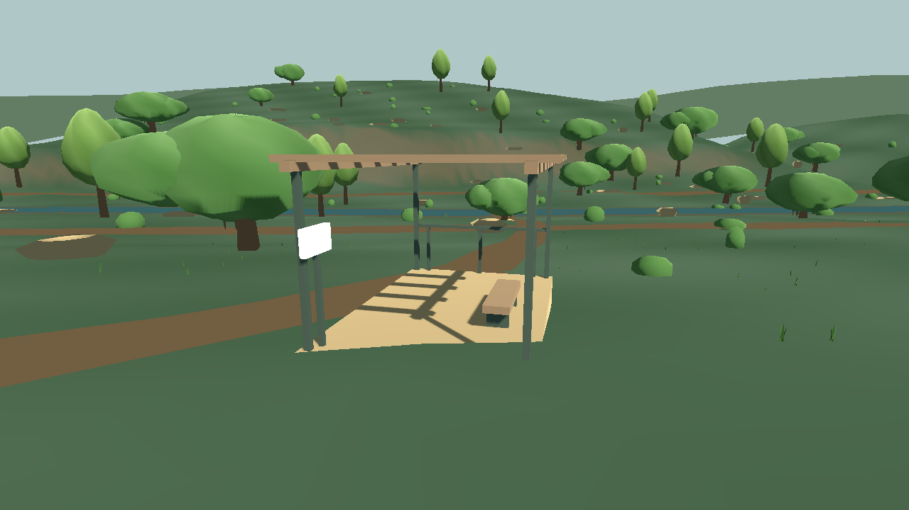
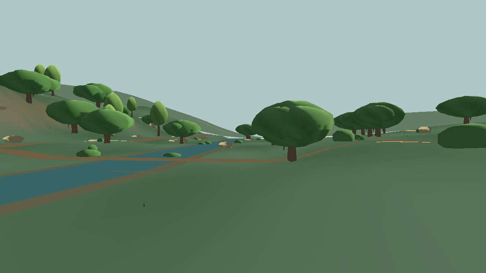
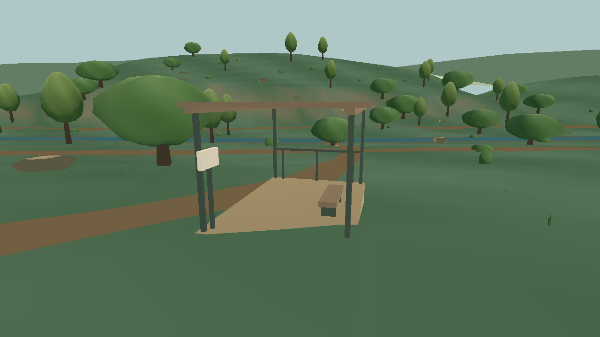

# Barton Creek walking-height art reference

This is an **illustrative Phase 1 art and scale fixture**, not a finished grounded painterly scene or a surveyed reconstruction. Open `res://scenes/art_reference.tscn` in the Godot project to review it at a 1.67 m eye height. The default view faces a small contemporary trail lookout; set `ENFRACTAL_ART_VIEW=creek` before launch for the creek and trail view. Set `ENFRACTAL_ART_PROFILE=low` for the lower graphics profile. The scene is separate from the current playable map and workshop.

| View | Repeatable capture |
|---|---|
| Contemporary lookout, standard |  |
| Trail and creek, standard |  |
| Contemporary lookout, low |  |

The source geometry is the pinned `barton_creek_v0` USGS 3DEP height grid and OSM trail and waterway centerlines. The source tree points in that package are already representative generated trees, not a census. Tree crowns, 45 additional seeded tree centers, grasses, shrubs, limestone outcrops, creek and trail widths, stone/soil colors, and the lookout are **authored interpretations**. The creek is a colored ribbon laid over terrain, not a hydrologic surface. The lookout is a semantic set of separate stone, steel, and cedar parts with editable source parameters in `art_reference.gd`; it is not an existing Barton Creek structure. Its short trail connector is also separately labeled. No external artwork or unlicensed imagery is embedded.

The local visual vocabulary is weathered limestone, dark creek water, broad oak-like crowns, taller cedar-like crowns, restrained understory, soil path, and a contemporary cedar/steel shade structure. The source tree tags select among three shared sculpted silhouettes with crooked/tapered trunks; authored trees use the same visual families. Creek-bank ledges and water highlights are illustrative. The palette starts from the existing `natural` Greenbelt material roles. It deliberately avoids a medieval or toy-town treatment, but the current vegetation, terrain transitions, water, and material depth still read as a procedural blockout. My visual self-assessment is **5/10 against the final grounded-painterly brief**, pending founder review, so this **does not pass the 8.5/10 art gate**. Next art work should use stronger original authored tree and limestone forms, a real creek-edge treatment, better atmosphere and material depth, and in-game comparison from the same walking path.

The fixture has no texture files, alpha foliage, post-process effects, or runtime shaders. One directional light supplies the scene; the low profile disables its shadows. Vegetation and rocks use shared meshes and `MultiMesh` instances. The source runtime remains identical on both profiles, so the low profile does **not** reduce map-package parsing or its memory cost.

| Measured scene construction count | Standard | Low |
|---|---:|---:|
| 192 m near terrain triangles | 18,432 | 4,608 |
| Coarse outer elevation triangles | 1,760 | 440 |
| Tree centers retained | 53 | 53 |
| Canopy lobes per tree | 1–3 | 1 |
| Shrubs / rocks / limestone ledges / grass tufts | 85 / 28 / 14 / 280 | 35 / 10 / 6 / 80 |
| Upper-bound mesh triangles, before visibility culling | 66,664 | 26,868 |
| Shared material instances | 14 | 14 |
| Shadow-casting lights | 1 | 0 |
| One scene-build sample on RTX 2070 Super | 383 ms | 239 ms |

The upper bound is counted from Godot mesh faces times instance counts, including geometry outside the camera; it is **not** measured triangles drawn on a frame. The build samples measure synchronous scene construction and map loading on the current machine, not steady-state frame time. Frame rate, GPU memory, repeated-run distributions, and the lowest target laptop still need measurement. No claim is made that this reference currently meets the roadmap's final art, device, or accessibility acceptance criteria.

The capture script is `game/tests/art_reference_capture.gd`. Set `ENFRACTAL_ART_CAPTURE` to an absolute PNG path, then launch Godot with `--path D:\Enfractal\game --script res://tests/art_reference_capture.gd` using the project's installed executable. `game/tests/art_reference_smoke.gd` checks source anchors, walking-height camera, the separate lookout and trail join, material/terrain budgets, and the reduced low profile. The capture script prints the generated counts, and the three images above show exactly what was visually reviewed.
