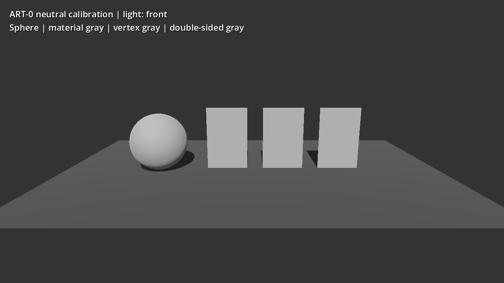
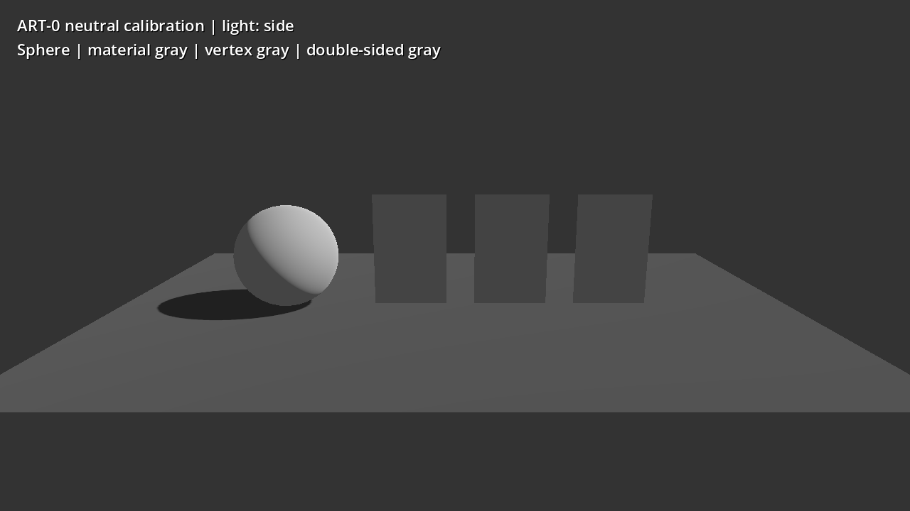
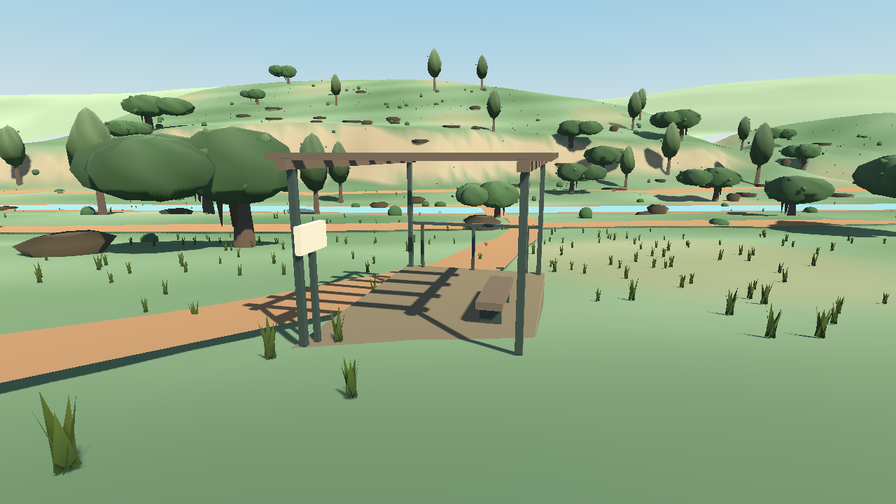

# ART-0: winding repair and renderer calibration

The confirmed orientation defects from the [research audit](painterly-render-audit.md) are repaired. Terrain now receives direct light and cast shadows on its upper surface. This is a renderer-correctness checkpoint, **not painterly-art acceptance**: the old reference assets remain visibly primitive and ART-1–3 still need to replace their art pipeline.

## Repair scope

- Main-map terrain interiors and stitched tile perimeters use Godot's clockwise front-face convention. Vertex positions, source heights, color data, UVs, and shading normals are unchanged. The terrain shader now culls backfaces.
- Reference near/far terrain, trail and creek ribbons, riffles, lookout connector, custom trunk, and rock side walls use the same convention. Correct canopy/leaf/grass geometry and rock top caps were preserved.
- Reference opaque materials cull backs; its grass sheets retain two-sided rendering. The legacy workshop rock change is limited to side-wall indices.
- Reference sunlight was reduced from 0.91 to 0.55 and ambient energy from 0.72 to 0.35 after direct light started reaching the terrain. Its unsupported Compatibility directional-PCSS setting was removed. This is restrained exposure calibration, not a broad style pass.
- The existing terrain-seam test had enforced a positive cross-product Y, which was the wrong convention. Its expectation now agrees with Godot's stock plane/box controls. Collider construction remains independent of the visual mesh and was not changed.

Godot documents [clockwise front faces](https://docs.godotengine.org/en/4.7/classes/class_arraymesh.html). Its Compatibility renderer [flips backface normals when a side check is active](https://github.com/godotengine/godot/blob/4.7.2-stable/drivers/gles3/shaders/scene.glsl#L2058); culling had hidden the original visibility symptom while permitting incorrect lighting.

## Geometry evidence

The new [`painterly_geometry_smoke.gd`](../../../game/tests/painterly_geometry_smoke.gd) checks **167,717 triangles** across stock controls, terrain at 2/8/16/32 m spacing, stitched boundaries, reference ribbons/trunk/rocks, and existing correct foliage. It also checks terrain vertices against source heights and face-culling intent. The test uses radial-outward side normals and an upward cap direction for the known rock forms, so unusual artistic shading normals are not mistaken for topology.

The [fresh diagnostic counts](art0-winding-counts.json) show zero supplied-normal disagreement for the repaired reference terrain, ribbons, trunk, and rock prototypes. Main-map tile `(8,8)` agrees for all **131,072** fine triangles and all **3,192** 16 m triangles including stitching. Canopy agreement is preserved.

The legacy workshop rock retains two triangles whose upward-biased **shading normals** oppose the mathematical face-normal check. Both side faces now point radially outward; this is why the regression tests known topology rather than blindly reversing every positive dot product. Its normals and shape were deliberately outside this bounded side-index repair. This legacy asset is due for replacement by the material/asset work.

## Neutral lighting and color evidence

[`painterly_light_calibration.gd`](../../../tools/diagnostics/painterly_light_calibration.gd) renders a neutral sphere and plane plus three gray cards: material albedo, vertex color, and a two-sided material. It uses a white sun (energy 0.55), white ambient light (0.18), Filmic tone mapping, roughness 1, and zero specular on the test materials. The light turns through front, side, and back positions; the camera then moves behind the cards.





The [back-light capture](../../images/art0-neutral-back.png) and [reverse-camera capture](../../images/art0-neutral-reverse-camera.png) complete the checks. From behind, the two one-sided cards disappear while the two-sided card remains visible and receives the rear light. The sphere and plane show the corresponding changing light/shadow direction.

All four rendered response checks pass, recorded with engine/renderer/device metadata in [calibration.json](art0-calibration.json):

| Check | Recorded result |
|---|---|
| Material gray and vertex gray agree | Front RGB equals 175/255 on both; side/back differ by only 1/255, within the 2/255 tolerance |
| Direct-light direction matters | Front sample 175/255; back sample 68/255 on the material-gray card |
| One-sided backface is culled | Reverse-view sample equals the 51/255 background |
| Two-sided rear receives light | Reverse-view sample 175/255 |

This supports the earlier conclusion that there is **no confirmed sRGB bug in the tested Compatibility path**. It does not establish identical color behavior in Forward+/Mobile, imported textures, or every shader. The slight vertex-color difference is within byte-level storage/sampling precision. The `vertex_color_is_srgb` switch is [not effective in Compatibility](https://docs.godotengine.org/en/4.7/classes/class_basematerial3d.html#class-basematerial3d-property-vertex-color-is-srgb).

The installed engine reports **4.7.2.stable.official.ed1daf0bf**, OpenGL Compatibility, NVIDIA GeForce RTX 2070 Super, driver 576.80. Captures are 1280 × 720. MSAA remains disabled for this baseline. These measurements do not establish integrated-GPU performance.

## Reference-scene check



The corrected reference retains legible terrain illumination and cast shadows without the clipped white slopes of the original winding-only experiment. Remaining bare ground, hard ribbon edges, simple trees and elevated-path shadows are art/placement problems; this image is not an accepted painterly target. The main workshop's separate lighting will need calibration during its new asset integration.

## Verification and reproduction

All five focused/affected tests exited 0 without stderr:

- `painterly_geometry_smoke.gd`: stock conventions, known fixture orientation, LOD/stitching and unchanged source heights.
- `terrain_seam_smoke.gd`: adjacent visual LOD seams and corrected front-face convention.
- `movement_physics_smoke.gd`: terrain-collision seams, bounded collider ring, spawn/walk/jump/glide/recovery and fly toggle.
- `art_reference_smoke.gd`: source anchors, walking camera, semantic lookout and bounded low profile.
- `workshop_art_smoke.gd`: saved editable path/platform relationship and walkable join in both profiles.

Run from the repository root using the installed Godot executable:

```text
godot --headless --path game --script res://tests/painterly_geometry_smoke.gd
godot --headless --path game --script ../tools/diagnostics/painterly_render_audit.gd -- --output-dir=.cache/art0-winding-audit
godot --path game --script ../tools/diagnostics/painterly_light_calibration.gd
```

The neutral capture requires a graphics context; its default outputs go into ignored `.cache/painterly-light-calibration`, with an optional `-- --output-dir=<path>`. For the Windows GUI executable, launch using `Start-Process -WindowStyle Hidden -Wait` with redirected logs as in the [audit reproduction notes](painterly-render-audit.md#reproduction). The commands used `.cache/godot/Godot_v4.7.2-stable_win64.exe`; no machine-wide settings were changed.

The historical audit's original captures remain unchanged. On repaired code, the optional winding-reversal experiment deliberately breaks the now-correct terrain, and backface culling makes it disappear; its output is clearly named as a reversal rather than an improvement.
