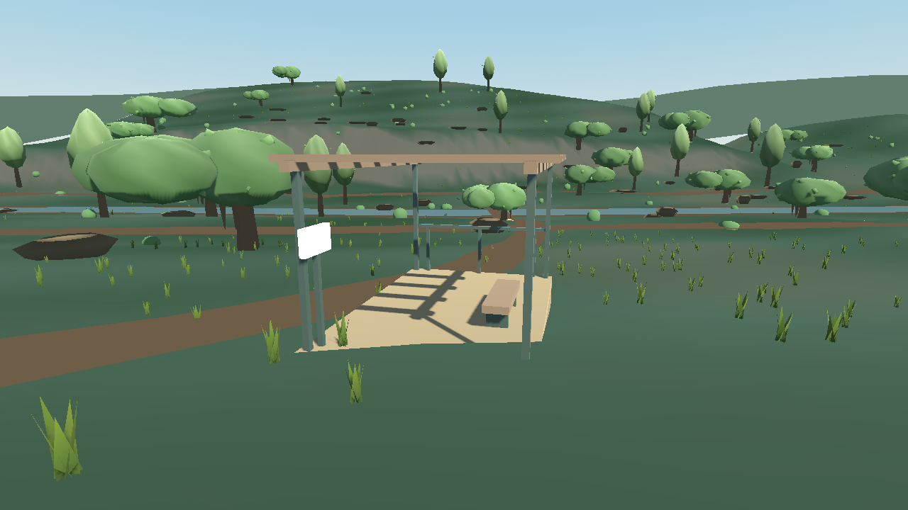
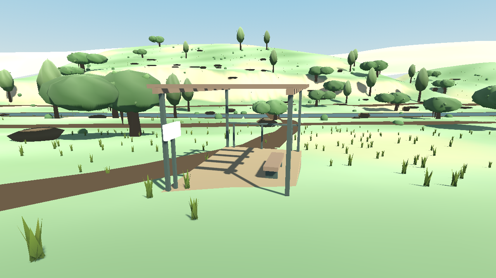

# Painterly renderer audit — 2026-10-02

This research audit found a real lighting defect as well as missing artwork. It does **not** certify the current scene, complete the art milestone, or demonstrate the intended painterly style. Production rendering code was not changed. See the [pipeline diagnosis](../../roadmap/research/13-painterly-pipeline-diagnosis.md) for the broader art workflow.

## Confirmed rendered defect

The art-reference terrain is wound opposite its supplied upward normals. Godot uses clockwise front faces. In the installed Godot **4.7.2.stable.official.ed1daf0bf** Compatibility renderer, `cull_disabled` enables a side check that flips the interpolated normal on backfaces. Consequently, these visible terrain surfaces receive lighting as if their normals point downward.

An isolated runtime A/B changed **only the triangle indices of `USGSHeightPatch` and `CoarseUSGSBackdrop`**. Camera, colors, normals, sun, materials, and every other mesh stayed fixed. Direct sunlight and visible cast shadows returned. The corrected diagnostic is overbright: its existing palette and light balance must be calibrated after the defect is repaired. It is diagnostic evidence, not an improved art deliverable.

Before:



Only the two terrain meshes' winding reversed in memory:



The captures used the default standard art-reference camera at 1280 × 720, OpenGL Compatibility, NVIDIA GeForce RTX 2070 Super, driver 576.80. They are the original isolated diagnostic captures, copied unchanged into this research packet. They are not low-end hardware evidence.

Relevant production locations are [`_make_terrain()`](../../../game/scripts/art_reference.gd#L176), its index construction at line 205, [`_make_distant_terrain()`](../../../game/scripts/art_reference.gd#L223), its indices at line 255, and `_material()` disabling culling at line 124.

Primary evidence: [Godot clockwise ArrayMesh winding](https://docs.godotengine.org/en/4.7/classes/class_arraymesh.html), [4.7.2 cull-disabled side-check activation](https://github.com/godotengine/godot/blob/4.7.2-stable/drivers/gles3/storage/material_storage.cpp#L1307), and [4.7.2 backface normal flip](https://github.com/godotengine/godot/blob/4.7.2-stable/drivers/gles3/shaders/scene.glsl#L2058).

## Counts and limits of the probe

The [diagnostic script](../../../tools/diagnostics/painterly_render_audit.gd) compares each triangle's cross product with the sum of its supplied normals. Negative dot products agree with Godot's clockwise convention; positive ones oppose it. A stock `BoxMesh` supplies a control. All entries below had zero near-zero dot products.

This interpretation is bounded to these known fixtures and their intended outward/upward normals. Deliberately unusual shading normals can invalidate it for an arbitrary mesh. The script is **not a general mesh-validity test**. Counts for `MultiMesh` objects describe the shared prototype mesh once, not every placed instance.

| Fixture / shared prototype | Supplied normals oppose front | Agree with front |
|---|---:|---:|
| Stock BoxMesh control | 0 | 12 |
| Art-reference near terrain | 18,432 | 0 |
| Art-reference coarse backdrop | 1,760 | 0 |
| Mapped trail soil | 560 | 0 |
| Creek bank | 412 | 0 |
| Creek water | 206 | 0 |
| Creek riffles | 110 | 0 |
| Lookout trail connector | 8 | 0 |
| Limestone outcrop / each ledge prototype | 32 | 8 |
| Art-reference trunk prototype | 64 | 0 |
| Each art-reference canopy prototype (variants 0, 1, 2) | 0 | 144 |
| Each art-reference leaf-cluster prototype (variants 0, 1, 2) | 0 | 8 |
| Art-reference grass prototype | 0 | 5 |
| Workshop oak prototype | 0 | 144 |
| Workshop juniper prototype | 0 | 128 |
| Workshop rock prototype | 52 | 11 |
| Main-map terrain tile (8,8), 2 m samples | 131,072 | 0 |
| Main-map terrain tile (8,8), 16 m samples including stitching | 3,192 | 0 |

The rendered A/B directly isolates the two art-reference terrain meshes only. Other counts confirm geometry/normal disagreement; their individual visual effect has not been isolated by separate rendered experiments. In particular, the main-map geometry was generated by the actual terrain job, but no main-workshop A/B was rendered. Its visual effect is inferred from the shared renderer behavior and `cull_disabled` terrain shader.

Additional locations to investigate: [`terrain_mesh_job.gd`](../../../game/scripts/terrain_mesh_job.gd#L112) and its stitched perimeter; [`photo_terrain.gdshader`](../../../game/shaders/photo_terrain.gdshader#L2); art-reference ribbon indices at lines 353–355, riffles at 311, connector at 400, trunks at 648, and rock sides at 491; workshop rock sides at [`workshop_art_dressing.gd:290`](../../../game/scripts/workshop_art_dressing.gd#L290). Some meshes have mixed orientation while canopies are correctly oriented: blindly reversing every mesh would introduce new errors.

## Color, renderer, and artistic limitations

- **No confirmed current sRGB bug.** Compatibility converts final albedo to linear internally. The `vertex_color_is_srgb` flag only affects Forward+/Mobile, so setting it will not fix this Compatibility output. Migration to another renderer needs a color-chart comparison. See [4.7.2 albedo conversion](https://github.com/godotengine/godot/blob/4.7.2-stable/drivers/gles3/shaders/scene.glsl#L2203) and [the property documentation](https://docs.godotengine.org/en/4.7/classes/class_basematerial3d.html#class-basematerial3d-property-vertex-color-is-srgb).
- **MSAA is disabled.** Both the project MSAA setting and the actual viewport read `0`. Evaluate a bounded MSAA setting with thin foliage and motion, measuring its cost; no performance benefit is claimed here.
- **The requested sun softness is ineffective.** `light_angular_distance = 0.12` in `art_reference.gd:134` requests PCSS, which is only supported for directional lights in Forward+. Compatibility does support ordinary shadow filtering. See [Light3D documentation](https://docs.godotengine.org/en/4.7/classes/class_light3d.html#class-light3d-property-light-angular-distance).
- **Avoid outdated renderer claims.** Godot 4.7 documents Compatibility support for tone mapping, depth/height fog, SSAO, glow, and MSAA. None alone creates the requested artwork. Volumetric fog, SDFGI, and directional PCSS remain separate limitations. See the [4.7 renderer comparison](https://docs.godotengine.org/en/4.7/tutorials/rendering/renderers.html).
- **The art recipe excludes useful tools.** [`art_reference.json`](../../../game/styles/art_reference.json) currently budgets zero texture pixels, forbids transparency and runtime shaders, and removes all sun shadows in low mode. Colored primitives, uniform roughness and sparse tufts cannot provide the references' painted material detail and broken foliage silhouettes. Replace blanket prohibitions with measured budgets. Alpha cutouts can cast shadows and differ from ordinary blended transparency; see [Godot's transparency modes](https://docs.godotengine.org/en/4.7/classes/class_basematerial3d.html#enum-basematerial3d-transparency).

Correct winding and calibrate exposure first. Then establish one convincing oak, a limestone-and-ground material set, and transitions between them in a small scene. Preserve contact cues and silhouette quality in a measured low profile. These changes require art review; passing this geometry diagnostic is not a substitute.

## Reproduction

From the repository root, with a Godot 4.7.2 executable available as `godot`:

```text
godot --headless --path game --script ../tools/diagnostics/painterly_render_audit.gd
```

The script path above is relative to the project directory; an absolute script path is also accepted. The default output directory is the repository's ignored `.cache/painterly-render-audit`. To select another directory, add `-- --output-dir=<directory>`; relative output paths resolve against the repository. Counts are written to `counts.json` and printed. The script fixes the known scene to its standard profile/default camera for reproducibility.

Omit `--headless` to render `before.png` and `terrain-winding-reversed.png`. Reversal happens only to fresh meshes in that diagnostic process; no resource or production scene is saved. It exits after capture. These output files are diagnostic artifacts and do not replace the committed workshop screenshots.

For the Windows GUI executable, use `Start-Process -WindowStyle Hidden -Wait` and redirect logs, or use the console executable. The audit's verified invocation used absolute paths:

```powershell
$engine = Join-Path $env:USERPROFILE 'Downloads\Godot_v4.7.2-stable_win64.exe\Godot_v4.7.2-stable_win64.exe'
$repo = (Get-Location).Path
$gamePath = Join-Path $repo 'game'
$probePath = Join-Path $repo 'tools\diagnostics\painterly_render_audit.gd'
New-Item -ItemType Directory -Path (Join-Path $repo '.cache') -Force | Out-Null
$arguments = @('--headless', '--path', ('"' + $gamePath + '"'), '--script', ('"' + $probePath + '"'))
$process = Start-Process -FilePath $engine -ArgumentList $arguments -WindowStyle Hidden -Wait -PassThru -RedirectStandardOutput (Join-Path $repo '.cache\painterly-audit.stdout.log') -RedirectStandardError (Join-Path $repo '.cache\painterly-audit.stderr.log')
$process.ExitCode
```

The portable checked-in probe was rerun headless with Godot 4.7.2: exit 0, no stderr, all counts above reproduced, MSAA project/viewport both 0. The visual A/B was performed by the preceding disposable version using the same two mesh reversals. No new acceptance score is assigned.
