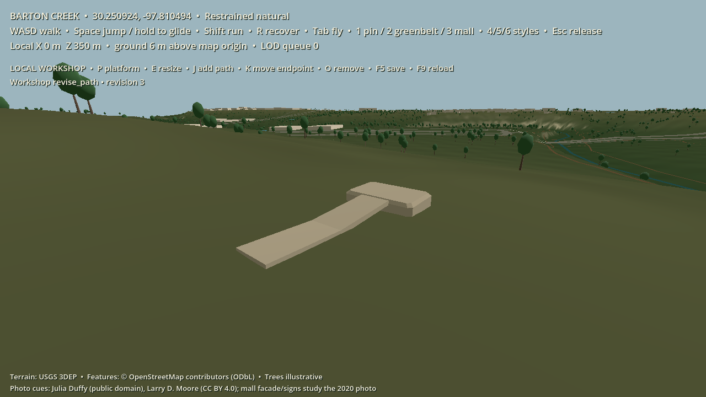

# Local structured workshop: path meets platform

This phase adds one editable construction relationship to the Barton Creek walking fixture. The player places a stone platform, adds a short stone path, and moves the path's endpoint. The connection is regenerated from those source parts; the unaffected platform node stays in place. All three pieces are natural-scale, use the approved rock material role, and have static walkable collision. They are illustrative player changes, not mapped or photographed Barton Creek structures.

In walking mode, **P** places the platform, **J** adds its path, **K** moves the path endpoint between two valid positions, **E** resizes a selected platform, **O** removes the selected part, **F5** saves, and **F9** reloads. Platform removal is refused while a path targets it; remove the path first. This is a developer-only local plot and actor, not a shared Home Earth permission or network authority.

The save remains `enfractal-world-state` **version 2**. It stores the platform and path as separate `edit:` entities, with their source dimensions, path points, generator versions, provenance, owner and target platform ID. New source parts also pin the `barton_greenbelt_study` style family/version and the SHA-256 of `greenbelt_styles.json`; paths pin the join-generator version. Validation rejects a changed style file or unknown generator instead of silently regenerating an older edit with a new treatment. The derived join carries the same style pin. Old platform-only version 2 saves without a style field still load as explicit legacy fixtures; a future production migration must assign their style contract before shared publication.

No join mesh or relationship is saved. On reload, each stored source is checked against the pinned map and current terrain, and `PathPlatformJoin` derives a `join:` relationship from the two stable entity IDs. Moving the endpoint updates the path and its join while leaving the platform entity and scene node intact. Save JSON rounds some floating-point coordinates by less than a micrometre in this fixture, so the integration test compares reloaded geometry within a `0.000001 m` tolerance while asserting IDs, versions, material roles and style hashes exactly. This tolerance is a local fixture rule, not a global-coordinate serialization contract.

The path is intentionally narrow: two source points, 0.8–3 m width, 1–8 m length, a bounded grade, and one clear platform edge. The join generator rejects unsupported corners, excessive gaps and steep connections. The workshop uses box-based walkable segments for the path and join; a physics ray in the integration test hits the join's top collider. This proves one small editable relationship, not a general road, staircase, accessibility, or terrain-cutting system. The visual boxes and local material need art refinement before they meet the finished grounded painterly reference.

Run `godot --headless --path game --script res://tests/workshop_path_integration.gd` to exercise authorization, source validation, deterministic joins, partial regeneration, save/reload, dependency removal and collision. For an image, run Godot with graphics enabled, set `ENFRACTAL_WORKSHOP_PATH_CAPTURE` to a PNG path, and use `--path game --script res://tests/workshop_path_capture.gd`. Existing platform-only workshop and creation-operation tests remain part of the compatibility check.
