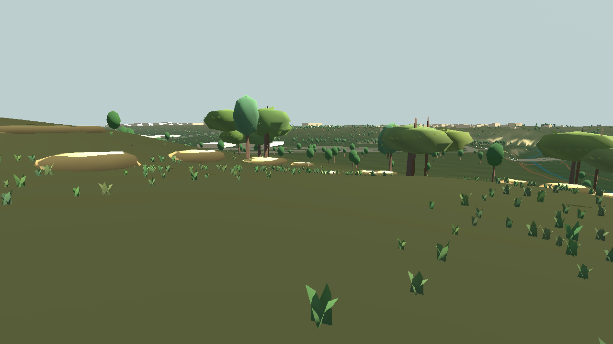
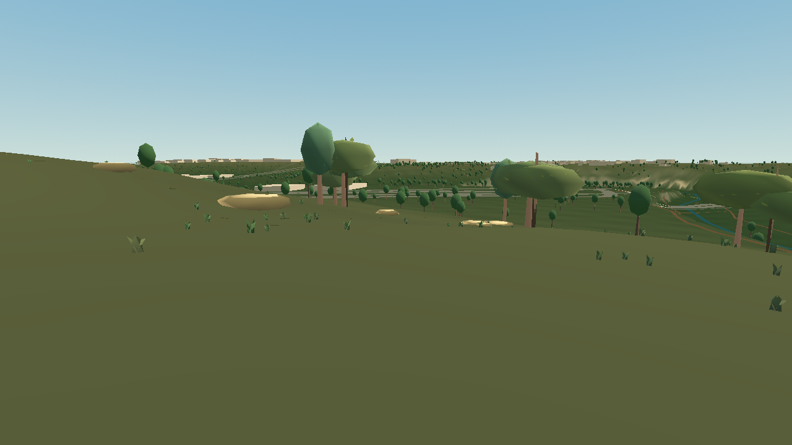
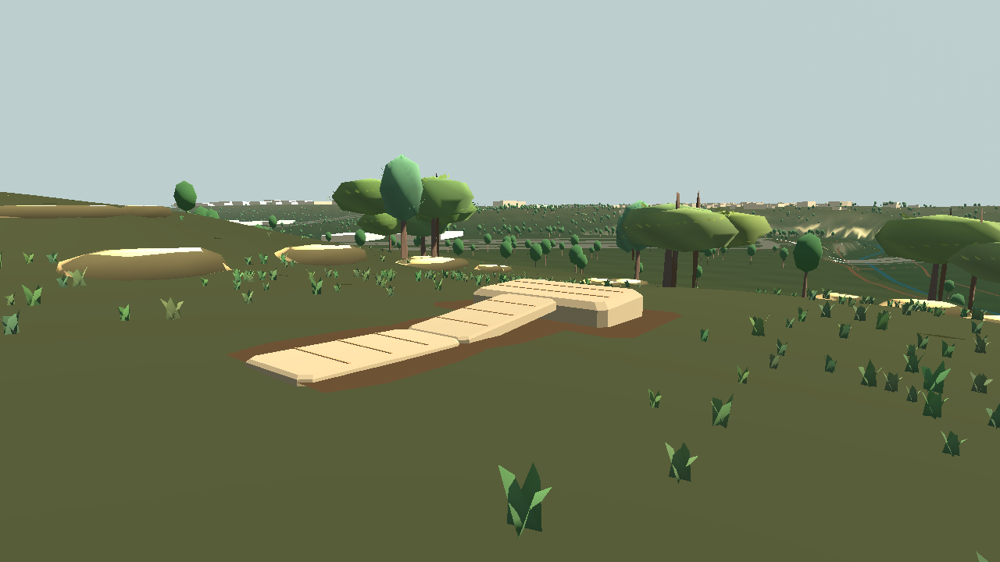
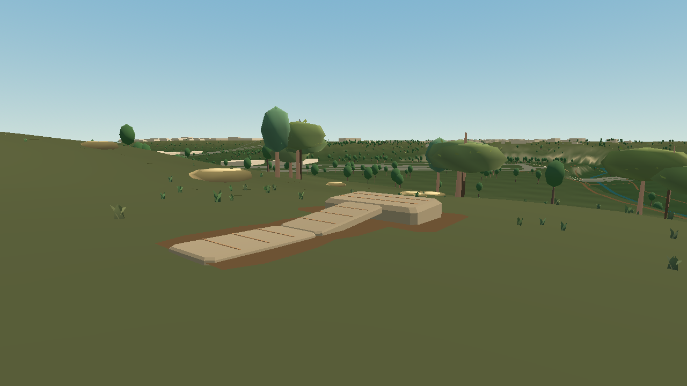

# Grounded painterly workshop integration — bounded study

This follow-up puts the Phase 1 visual vocabulary around the **actual editable** local path and platform at the existing workshop plot near local `(0, 350)`. It does not move the plot or alter the pinned `barton_creek_v0` terrain, source features, collision grid, edit log, style pins, or derived join. The closest mapped Barton Creek centerline is about 195 m from the plot, so no creek was invented at the build site.

| Same 1.67 m walking-height camera | Standard | Low |
|---|---|---|
| Before player edit |  |  |
| Player-revised path and platform |  |  |
| Reloaded saved source parts |  |  |

The player action sequence places a stone platform, adds its structured path, then moves the path endpoint. The existing join generator regenerates the connection. Terrain-following soil contact and stone course lines now continue across the source path, generated join, and platform; they are derived visuals, not independently persisted entities. The platform's soil ring stays below the deck top to prevent it from cutting through the walking surface on sloped terrain. All three parts keep their existing collision surfaces and remain editable after save/reload. A repeatable Godot smoke test checks both profiles, the same saved source state, the join's stable ID and walkable collision, and the shared visual detail meshes on all three parts. The captured revised and reloaded PNGs have identical file hashes within each profile.

The surrounding tree centers, grasses, and limestone stones are fixed-seed **illustrations**, labeled as such on the scene nodes. They sit on sampled USGS terrain and use the existing style catalog's color roles, but are not surveyed individuals. After the founder supplied new painterly 3D examples and an [environment-art breakdown](https://80.lv/articles/breakdown-making-3d-landscape-look-like-painting), this pass gave live-oak-like crowns horizontally layered lobes, visible branch runs, and small geometric leaf marks. Compact Ashe-juniper-like forms remain distinct. These are original procedural meshes, not imported reference assets; the warm autumn color in the example was not copied into the Barton scene. Two tree centers were repositioned within the illustrative plot to frame the authored path at walking height without changing the source map.

The low profile retains two oak lobes and a branch gap but reduces leaf marks, grasses, and rocks. Small terrain-following opaque color strokes and varied limestone vertex colors add near-field detail without changing 3DEP heights or collision. The scene uses one warm directional light, a built-in procedural sky, and only sparse distance fog in standard mode; standard shadows stop at 125 m, while low disables shadows and fog. No external textures, alpha foliage, extra lights, or custom post-processing passes were added. Broad ground-color overlays were tried and removed after walking-height captures revealed bright polygon seams. The dressing still has no tree/rock collision, so it remains a visual study rather than production vegetation.

| Added near-field geometry upper bound | Standard | Low |
|---|---:|---:|
| Authored tree centers | 12 | 12 |
| Crown lobes | 33 | 21 |
| Limestone stones | 34 | 13 |
| Grass tufts | 450 | 85 |
| Ground color marks | 250 | 110 |
| Total dressing triangles before culling | 13,670 | 5,811 |

Those counts are from mesh faces multiplied by instance counts. They cover the added near-field dressing only; they are not total scene triangles, rendered triangles, GPU memory, or a minimum-device frame-time claim. The low setting reduces this dressing while the existing base map still loads; wider streaming and residency work remains separate.

This moves the playable edit beyond a plain beige block: the stone courses and terrain-following soil contact connect the path, join, and platform at walking height, while the nearby trees provide some mid-ground framing. The same camera's [previous standard frame](../../images/barton-workshop-art-standard_previous.png) and [previous low frame](../../images/barton-workshop-art-low_previous.png) show the earlier smooth-blob canopy and sparse foreground for comparison. **Self-assessment is about 5.5/10 standard and 5.0/10 low, below the 8.5/10 goal.** The source terrain still reads as a broad, flat olive expanse from this angle; many crowns are solid volumes instead of convincing foliage; the mapped distant trees and creek remain schematic; the scene lacks tactile material depth and local tree/rock interaction. The art reference's contemporary lookout is still a separate illustrative fixture, not a playable edit. A later pass needs a coherent terrain-material solution shared with the streaming renderer, stronger original foliage and limestone assets, controlled composition from several walking viewpoints, and a real low-end GPU review.

Run `pwsh -NoProfile -File tools/capture-workshop-art.ps1` from the repository root to remake all six captures using installed Godot 4.7.2 or `ENFRACTAL_GODOT`. The script captures the same eye and focus with standard and `ENFRACTAL_ART_PROFILE=low`. `game/tests/workshop_art_smoke.gd` is the focused headless validation.
