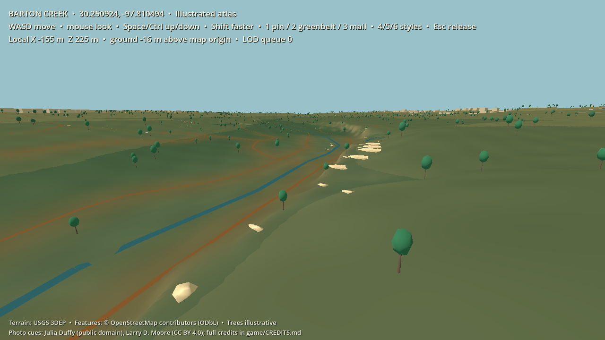
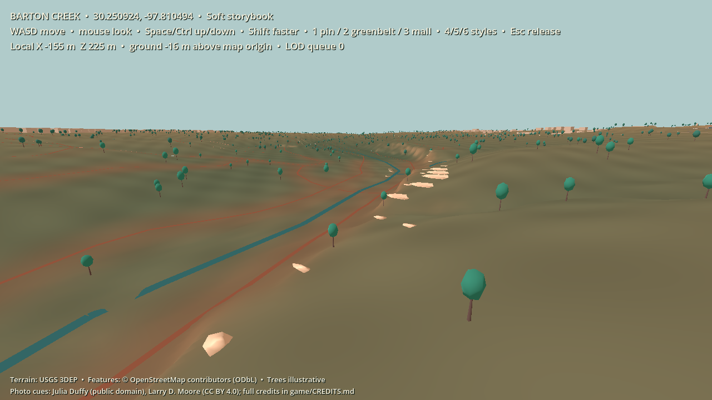
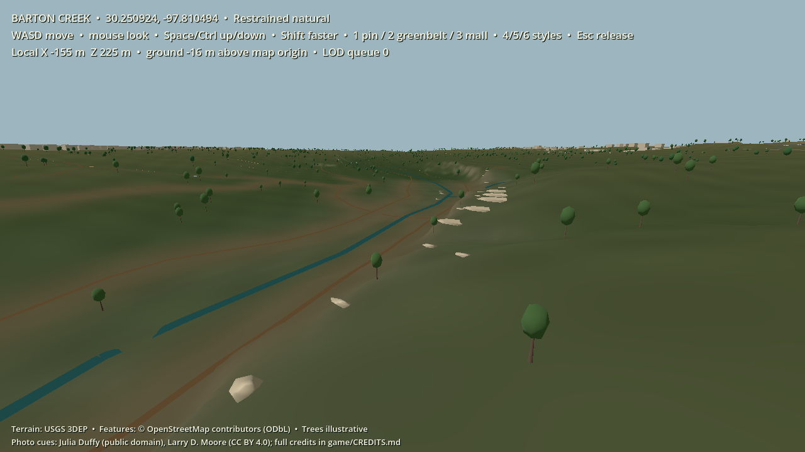

# Greenbelt visual style study

This first art experiment uses the same Barton Creek elevation grid, mapped creek and trails, representative trees, and photo-guided color/rock cues in all three views. The fixed camera is a small Greenbelt viewpoint near the existing photo pilot, within its 260 m radius. There is no new surveyed or reconstructed geometry. The limestone stones and tree locations remain illustrative.

| 4 — Illustrated atlas | 5 — Soft storybook | 6 — Restrained natural |
|---|---|---|
|  |  |  |
| Landform color bands and clear creek/trail contrast. | Warm limestone, blue-green foliage, and a gentle color wash. | Quieter palette nearest the two existing photo references. |

Run [`run-style-study.ps1`](../run-style-study.ps1) to start at the comparison viewpoint. Press **4**, **5**, or **6** to change the style without rebuilding terrain or moving the camera. **2** returns to the wider Greenbelt view. The original [`run-map.ps1`](../run-map.ps1) starts with the natural treatment. The atlas study launch sets `ENFRACTAL_STYLE=atlas`; `ENFRACTAL_VIEW=greenbelt_study` selects the fixed camera. These variables can also be set manually for automated captures.

The editable [style recipe](../game/styles/greenbelt_styles.json) holds terrain colors and banding, photo overlay colors and strength, semantic object colors, sky, and sunlight. The [viewer](../game/scripts/map_viewer.gd) applies those values at runtime; the [terrain shader](../game/shaders/photo_terrain.gdshader) uses the same elevation/slope data and photo overlay for every style. The existing [map package](../maps/barton_creek/README.md) and [photo evidence](../maps/barton_creek/photo_pilot/README.md) remain the geographic and reference inputs. Changing a recipe color does not move the trail or change the source elevation. Playable-world collision has not yet been implemented.

These are material and lighting studies, not finished environment art. The photographed limestone is a regional reference without an exact camera location, and no photogrammetry model has been produced. Original, overlapping, geotagged photos of a specific rock shelf or trail feature could later become a measured model in Blender, simplified and exported for Godot. That model would be shared by all three treatments, with each recipe determining its appearance.

## Diagnostic performance capture

The three screenshots were captured at **1280 × 720** with Godot 4.7.2's Compatibility renderer on an **NVIDIA GeForce RTX 2070 Super**, in a hidden window. After the near terrain finished loading, 101 frame intervals were sampled per style. All three had approximately **6.94 ms median** and **6.94–6.97 ms 95th-percentile** process intervals. These values are effectively at the display's frame pacing limit and cannot resolve small style costs. Hidden-window timing is not a playable-game benchmark, and this laptop result does not certify the planned 8 GiB integrated-graphics profile. A later representative movement route, visible release build, and actual low-end machine are needed before setting a final style budget.

The styles use the same object count and mesh detail. The atlas adds a simple terrain color-band operation; storybook uses slightly more color variation; natural retains photo colors most strongly. None depends on real-time global illumination, ray tracing, or a dense photogrammetry mesh. This makes them useful initial comparisons while keeping the map builder and future art assets modifiable.
