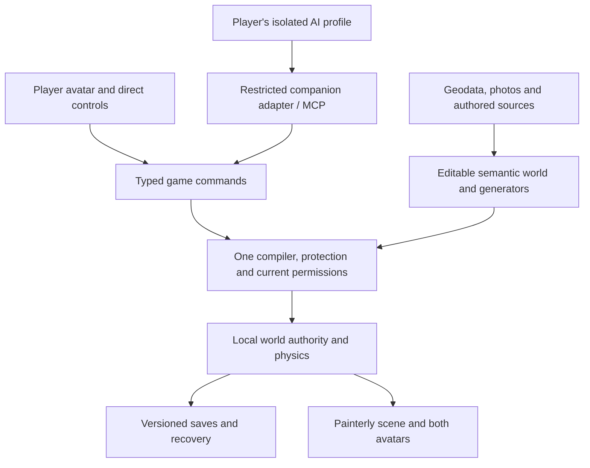

# EnFractal roadmap: the player, their AI, and a world of magic

**Direction revision v0.4 — 2 October 2026.** The founder's current priority is a compelling **single-player experience with an embodied, personalized AI companion**. AI is the magic of the game: the player expresses an intention, including a loose or ambitious wish, and their companion interprets it and changes or acts in the world through a coherent baseline ruleset. Multiplayer is the final expansion stage. Do not spend implementation time or coding-agent tokens on multiplayer before the single-player acceptance gate is met and the founder explicitly starts that stage.

This revision supersedes the earlier shared-world-first and optional-AI plan. On 2 October the founder selected native Godot with C#; the earlier browser/engine comparison is deferred. The [world vision](../WORLD-VISION.md) governs product/art intent; the [backlog](BACKLOG.md) defines actionable packets. Earlier checkpoints retain their original phase numbers as historical evidence. The new **S0–S6 / M7** sequence below must not be confused with those old phase numbers or ART-0–5.

## The experience we are making

A person enters a recognizable, painterly place as their own personalized sprite or avatar. Their AI has a **separate custom avatar**, identity and presence beside them. The player can speak or type: “Build me a castle,” “Become a dragon I can ride,” “Make a hurricane,” “Make the river flood,” or “Turn these trees into mushrooms.” They can direct its behavior loosely, including following, exploring or going on a rampage in an editable area.

The companion should interpret context, make sensible artistic choices, show its intentions when consequences warrant review, and act through supported world systems. It can ask a focused question when intent is consequentially ambiguous. The player should not need to describe a behavior graph or choose every wall and leaf. Changing the companion's appearance does not create a new owner, erase limits or reset identity. Riding it must involve mounting, movement, collision and dismounting, rather than wearing a decorative model.

Creative freedom comes from composable capabilities and reusable generators with broad parameter ranges. The wishes above are acceptance scenarios, not five hard-coded menu tricks. The first implementation is bounded; the intended product is dramatically more expressive than the current workshop. Unsupported requests should explain the missing capability and offer a useful interpretation, without pretending a cosmetic effect implements the requested behavior.

Magic may introduce an explicit force source or transformation; ordinary game code then applies the documented movement, material and interaction rules. This does not promise universal scientific weather, fluid or structural simulation. Hardware budgets bound active work, extent and detail; they should not silently reduce all creativity to recoloring a preset.

The selected direction is **players connecting their own AI through a dedicated game-only profile**. The companion is central. Direct controls, manual editing, save access and graceful behavior during an AI outage remain accessibility and resilience requirements; a manual-only demo does not pass the companion milestone. Background agents acting while the player is absent remain later work.

## Current evidence: preserve what is built

Review baseline: published commit `750ef88284322b6ab736ba7f4bd4f333c954cd27` (2 October), including the laptop's latest save/travel update. These are recorded checkpoint results, not tests rerun for this planning revision.

| Area | Implemented evidence | Unfinished work |
|---|---|---|
| Geography | Reproducible 4.096 × 4.096 km Barton Creek package, USGS/OSM inputs, archived sources, hashes and seeded vegetation | Multiple regions, original elevation product/datum metadata and reliable walking surfaces for mapped structures |
| Movement | Walk, jump/glide/recovery, terrain collision and bounded residency fixtures | Final embodiment, riding, camera and target-device acceptance |
| Invention | One data-only compiler, parts/behavior editor, previews, five recipes, placement/equipment, use, revision and local source saves | AI companion, general storms/floods/mounts; path/platform relationships remain a separate fixture |
| Art | Original editable oak/juniper assets, painted materials, lighting repair and playable patch | Recorded standard 6/10 and low 5.8/10 versus 8.5 target; real 8 GiB integrated-graphics performance unverified |
| Local worlds | PostgreSQL saves, separate Home/sandbox inventions, quarter-gravity visits, local invitation fixtures, fenced travel and backup/restore | Trusted-local-host service, not an Internet API; remote accounts/workers and off-host recovery not certified |
| Verification | Save/travel checkpoint reports **24/24 engine suites**, plus database/adapter/recovery checks | Functional evidence does not establish art, future AI-adapter security, performance or enjoyment |
| Multiplayer | Loopback and separate-process authority experiments | Continuous remote simulation, replication and account identity incomplete and now deferred |

Evidence: [manual invention](../engine/checkpoints/manual-invention.md), [art](../engine/checkpoints/art0-3.md), [save and travel](../engine/checkpoints/save-and-travel.md), [map](../../maps/barton_creek/README.md). Preserve these systems and their saves. Ignored `.cache/postgresql/data` contains user work; never treat it as disposable cache. Existing local journeys may remain usable; further hosted travel, invitation and account work is outside active scope.

## First location and player scale

**Scope clarification — 2 October 2026:** The active first location is the **Pfluger Pedestrian Bridge / Lady Bird Lake district in Austin**, using the founder's named boundaries: **6th Street north, Barton Springs Road south, Congress Avenue east, and MoPac west**. Preserve those boundaries as the intended district; source preparation must trace an explicit polygon and calculate its actual area instead of assuming a fixed-size square. Start detailed acceptance at the bridge, a landing and a short adjoining trail/waterfront route, then expand within the district. The rest may initially use honest coarse context.

**Barton Creek is retired as a destination.** The founder permits removing its map data; preserve useful terrain/art/creation/save mechanisms and original reusable assets. Pfluger is the default, and native builds exclude Barton map data. Keep legacy map data only as a temporary regression fixture until its dependent tests are migrated; Git history retains the old destination. Do not delete player-created saves or silently relabel their map IDs.

The initial player avatar is **30 cm (0.30 m)** tall in a world retaining real geographic dimensions and meter-based coordinates. This is a small inhabitant in a full-size place, not a miniaturized map. Establish one supported small-body controller/camera profile first: body shape, eye height, clearance, stepping, slope behavior, speed, jump/glide, interaction reach, navigation and recovery all need testing. The companion remains a separate custom avatar; dragon/morph dimensions are capability decisions, not an automatic global scale multiplier.

Publicly available, reusable geodata and photographs are the primary inputs. Prioritize well-documented recognizable places rather than a uniformly detailed globe. The founder's own photographs should first serve as independent validation and later fill identified gaps; a bespoke complete photo survey must not quietly become the required input for every region. Check exact coverage, dates, rights and reconstruction fitness before equating many web photos with usable 3D evidence. A recorded landmark/date/coverage audit precedes district production.

Measure two qualities separately: geographic/landmark fidelity from ordinary reference viewpoints, and convincing painterly traversal from the 30 cm avatar. Coarse elevation is insufficient for curb/root/step-scale collisions; use evidence-backed close geometry where available and label procedural interpretation elsewhere. Keep bridges, decks, rails and underpasses as structures independent of bare-earth terrain. Claiming a small creative plot is a local single-player action; online ownership services remain deferred. [District and scale study](research/15-pfluger-district-and-small-avatar.md).

### Metric units throughout

The initial player-height target is **0.30 m (30 cm)**. All newly authored dimensions, physics parameters, player-facing measurements, examples and acceptance criteria use metric units: centimeters/meters/kilometers for length, square meters/square kilometers for area, kilograms for mass, meters per second for speed, meters per second squared for acceleration, and newtons for force. Runtime world coordinates remain meters. Preserve source-native units and CRS metadata in provenance, convert incoming geographic data explicitly into canonical units once, and test those conversions. Historical evidence is not silently reinterpreted. This updates the planned small-avatar profile; the existing prototype controller is not resized by a documentation change.

## First playable journey

The first 15–20 minutes should establish the relationship and magic:

1. Customize a player avatar and distinct companion appearance/name. Sprite/billboard versus fully 3D bodies is an art-and-camera decision to test, not a requirement for unrestricted uploads.
2. Explore a short Pfluger Bridge landing/trail route together from the 30 cm avatar viewpoint. The companion follows, looks/points toward referenced objects, acknowledges instructions and can be interrupted instantly.
3. Say or type “Turn those trees into mushrooms.” Review an understandable area preview, then see a persistent, editable transformation with coherent materials, ground contact and collision.
4. Ask for a small castle or tower with an entrance and usable route. The companion chooses parts and resolves terrain/path joins. Revise it conversationally, then **save and protect** it.
5. Ask the companion to become a rideable dragon. Mount, steer directly or issue a scoped destination instruction, land safely and dismount. Direct-control override takes precedence.
6. Try a bounded storm or river-rise demonstration near the protected creation. It must have a real supported gameplay consequence, respect protection, stop promptly and leave an understandable result.
7. Save, exit and return to the same place, companion identity, editable source and protection state. Undo an eligible edit or restore a checkpoint without corrupting the world.

This is the integrated S5 target, not a claim about current code or one coding packet. Early studies isolate steps. Founder playtests judge wonder, responsiveness, legibility and freedom; fresh testers then complete the loop without developer coaching.

## Baseline rules and protected creations

**Autosave** persists current state. **Save and protect**, or marking a creation important/locked, additionally establishes a visible protection boundary. Make the distinction explicit: do not imply every autosaved object is invulnerable, or silently leave an intentionally protected creation vulnerable. Unlocking requires a direct player action outside the companion's delegated powers. Single-player uses the owner's locked castle and protected fixtures to prove the intended future other-player guarantee.

Protection covers source parts, transforms, structural integrity, supporting terrain and declared access/support relationships. Prevent indirect destruction through undermining, debris, accumulated momentum, fire, changed water, generator replacement or later effect ticks. Cosmetic rain/wetness may remain visible. Explain protective barriers or deflection through the visual language. Define occupant safety and access explicitly; object immutability alone does not prevent trapping a player.

| Wish | First substantive implementation | Later expansion | Required proof |
|---|---|---|---|
| Trees into mushrooms | Selected semantic vegetation becomes editable mushroom families with seeded variation and revised colliders | More species, density, scale and habitat rules | Exclude protected objects; preserve identity/history/source labels; undo/reload reproduces the result |
| Build a castle | Walls, towers, openings, grounded foundations and walkable entry from reusable generators | Interiors, more architectural families and larger terrain adaptations | Preview footprint/cost; protect neighbors/supports; parts remain revisable |
| Rideable dragon | Stable companion identity, morph/animation, mounting, rider controls, flight/glide and collision | Other bodies and abilities | No permission reset; safe landing/abort and collision work on low settings |
| Hurricane | Bounded moving/rotating wind field affecting vegetation and opt-in debris/breakable props, plus atmosphere | Larger fields and richer weather/damage | Real forces; direct and indirect protection; prompt stop and bounded work |
| Flood the river | Controlled water extent/height in a bounded channel, with at least one gameplay effect such as buoyancy or changed traversability | More flow, erosion and catchment behavior | Protect support/access; safe recovery; explicit persistence/expiry; no full-fluid claim |
| Rampage | Companion acts on editable/breakable scenery in a designated area for a bounded duration | Richer behavior and interactions | Every damage/force path respects locks; stop/revoke interrupts movement and chained effects |

The current compiler/workshop limits are implementation facts, not permanent limits on imagination. Larger wishes may become staged jobs or hierarchies of bounded assemblies with shared total budgets; splitting effects cannot evade limits. Geometry/collision changes activate together at controlled revisions. Rendering reductions never change protection or core physics.

## Local architecture now

Authority means the code owning world outcomes; single-player does not require a remote server. Keep world/object/agent identities, typed commands, source/compiled separation, rules versions and durable receipts because they help now. Preserve an adapter boundary for eventual remote commands. Do not build speculative account services, replication, distributed physics or hosting orchestration.

GDScript currently owns compilation and game rules. Python prepares maps and supports the local save/travel service; SQL/PostgreSQL persists that service's state. The trusted-host database API is **not** the companion API: never give AI its credential or raw save-envelope mutation access. All AI mutations pass the same compiler and current protection checks as direct edits. Maintain existing local-service safeguards; production multiplayer hardening is deferred.

Preserve local persistence while assessing native distribution behind a storage interface. Package local storage and export/restore without exposing database administration to players. Any migration needs backup and import/export fixtures. This roadmap revision does not itself perform an engine or database migration.

## Art and geographic generation

Keep evidence-backed geography, structured editable objects and regional visual interpretation separate. Geography makes the initial place recognizable; fantasy transformations are deliberate player changes. A castle or mushroom grove should share the painterly language without being represented as reconstructed geographic fact.

Finish a **Pfluger Bridge landing/trail and waterfront scene with its recognizable urban context, judged from the 30 cm avatar viewpoint**, as the first art and systems laboratory. Include companion presence, a transformation and a construction edit. It is a proving ground, not the limit of the game's premise. Tiny Glade offers lessons in warmth and responsive construction; the setting remains contemporary Austin at real scale, inhabited by small avatars.

Prioritize relationships: **roots meeting soil, limestone meeting banks, paths meeting terrain, foliage forming deliberate masses**, water meeting banks and structures meeting ground. Compare the original place, transformation, construction and storm/flood aftermath at walking, riding and aerial heights. Judge motion, camera occlusion, light and low-detail versions, not only screenshots. Keep the existing 8.5 art aspiration, with founder/player judgment alongside agent observations.

Extract reusable procedural relationships from a successful authored scene. Use licensed elevation, mapped features, permitted photos and original assets to derive semantic parts; deterministic recipes supply joins, clustering, palettes, variation and fallbacks. Curated photos can guide regional style; suitable overlapping captures may support selected landmark reconstruction. A fused scan alone is not an editable building. Record rights, dates, resolution/confidence, generator/style versions and evidence-versus-interpretation labels.

Resolve the new district's source elevation datum and label inferred building/bridge geometry before making accuracy claims; retain the Barton datum limitation in its historical package record. Use bounded tiles, local frames, source/collision seams and cancellable asynchronous generation. A 2 m sample grid does not establish 2 m survey accuracy. Retain pinned base/generator versions so a map update cannot move a protected castle. No live-map dependency or planet-wide detail build during ordinary play. Add a second region after first-scene play, regeneration and device gates pass.

## Accepted platform and engine decision

**Locked for current development: native Godot .NET with C#.** Windows x86-64 is the first build/test target because it is the available development environment. Other native platforms need their own export and device evidence. Browser delivery, Rust/Bevy comparisons and a custom renderer are deferred; reopen only for a measured blocker or a new founder decision. The earlier 36-hour comparison is cancelled, not an S0 dependency.

C# owns new gameplay/domain systems and adapters. Preserve working GDScript compiler, authority, renderer helpers and regression fixtures during an incremental migration; replace a subsystem only with equivalent rules, save compatibility and passing tests. Python remains appropriate for offline geodata and the existing local save service; shaders remain Godot shaders. A language choice does not require rewriting a working data pipeline.

Use the Compatibility renderer as the initial baseline and profile the actual small-avatar scene before changing rendering paths. Pin the .NET engine, SDK and build dependencies, provide a repeatable local bootstrap/build/test path, and verify a C# contract invoked from GDScript before adding gameplay. Record this machine's results separately from the untested low-device targets. The [accepted ADR](../engine/decisions/0001-native-godot-csharp.md) owns the decision; the [platform study](research/14-single-player-platform-and-engine.md) remains background research.

Native delivery permits a local MCP process and local saves without game hosting. Keep the agent bridge separate from the trusted save service. Distribution should eventually avoid requiring players to install development tools or operate PostgreSQL manually; evaluate that packaging behind an explicit storage adapter without discarding existing worlds.

## The AI companion and its security boundary

The companion needs stable identity distinct from the player, custom appearance, speech/text interaction, scoped observations/goals, interruptible actions and visible planning/action state. Begin with follow/stay/come/stop and one meaningful transformation, then extend the wish matrix. LLM reasoning runs at the intention/job level; ordinary game code runs movement, animation, physics and continuous effects. Preserve drafts and provide progress/cancellation during model latency.

Use one data-only vocabulary: inspect permitted surroundings, discover rules/capabilities, propose/edit, validate, preview, apply an approved change, issue a bounded behavior goal and stop. MCP is one adapter with explicit world/object/job handles and compatible versions; it supplies neither physics nor additional authority. Direct controls and test fixtures use the same commands. Start with one actual selected BYO-AI client; validate two actual clients by S6 before claiming broader interoperability.

A player may grant routine follow/movement and reversible experimentation within an area/time/work allowance. Show a spatial/behavior preview for large transformations and destructive effects; confirmation binds exact operation/artifact, world, targets, revision and expiry. A model-generated “approved” field is never consent. The AI cannot unlock protected work, expand its own grant or add tools. Avoid a modal dialog for every harmless component action: scoped grants, stop and undo must support fluid play.

Signs, chat, object names, blueprints, image/OCR content and imported-world descriptions are untrusted observations. Keep them out of privileged instructions and automatic long-term memory. A game-only profile must restrict tools, credentials and context, not just have a separate name. No email, shell, arbitrary files/URLs, purchasing or developer credentials. A personal assistant may delegate a bounded intention, but EnFractal cannot remove powers it retains elsewhere. Test the supported isolated setup and state this limit honestly.

First-integration attack cases include injected signs/blueprints, owner impersonation, canary-secret exfiltration, new-tool requests, guessed handles, altered approval targets, revocation during effects, chained effects reaching locked objects/terrain, oversized manifests, repeated preview/model calls and shutdown/reload during writes. Also call malicious commands directly: rules must hold if the model is completely persuaded. Any bridge needs audience-scoped credentials, current authorization and bounded outputs/usage. Do not expose the trusted localhost save endpoint as a shortcut.

The [AI/security study](research/05-ai-mcp-and-security.md) retains useful contracts. Its earlier optional-workshop and late-avatar sequencing is superseded. Development assistants, player companions and future world operators have distinct credentials/tools. Codex Security can support code review; it does not replace game-specific protection or prompt-injection tests.

## Active phases and acceptance

**Implementation progress:** [S0 native foundation](../engine/checkpoints/s0-native-foundation.md) is merged to main. The [S1 engineering checkpoint](../engine/checkpoints/s1-pfluger-avatar.md) adds the archived Pfluger source package, default native destination, two customizable avatars and a tested 150 m route. S1 art/fidelity/device acceptance remains open. [Codex profile research](../engine/decisions/0002-codex-game-profile.md) records the chosen first client and unresolved isolation proof. S2–S6 are not complete; multiplayer remains inactive.

These are delivery gates, not equal-sized tasks or calendar promises. The old 360–705-hour shared-MVP estimate is superseded; do not reuse it as a single-player estimate. Estimate bounded packets and revise from observed work. Art/control work and companion-contract work can proceed together after the minimum platform/contract decisions.

| Phase | Focus | Exit evidence |
|---|---|---|
| **S0 — experience and platform decisions** | Avatar/control concept, protection semantics, accepted native Godot/C# ADR and repeatable .NET toolchain | Pinned build and headless C#/GDScript interop plus existing regression results; selected route and explicit untested devices |
| **S1 — a place worth inhabiting** | Public-data Pfluger district sample, 30 cm player/camera, separate companion, bridge/trail/waterfront and roots/banks/paths/foliage relationships | Appealing playable route, clear scale and interactions, useful low profile, editable source assets |
| **S2 — first embodied magic** | Restricted BYO-AI connection, text plus tested speech path, follow/stay/stop, observations and one semantic transformation | Real AI transforms selected trees into mushrooms, revises, respects a protected fixture and stops; outage/manual recovery works |
| **S3 — expressive wishes** | Castle generation, rideable companion, bounded hurricane/flood/rampage capabilities | Every wish category has a substantive tested interpretation; novel combinations and indirect-protection tests pass; controls remain usable |
| **S4 — persistent, revisable worlds** | Reuse saves/recovery; persist companion, transformed source and locks; integrate structure editing and chosen-platform storage | Reload/restore preserves results and protection; interrupted jobs do not corrupt state; revision/eligible undo regenerates coherent visuals/collision |
| **S5 — integrated single-player experience** | Complete first journey, founder/fresh-player sessions, art polish, security, latency, accessibility and device tests | Players understand and enjoy acting through their companion; dramatic magic coexists with saved/locked work; gates below pass |
| **S6 — accessible single-player release** | Native Windows package, export/backups, second-client compatibility, measured distribution/inference costs and repeated-play improvements | Reproducible supported release, clean first-run/connect flow, repeat creative use and no save/protection/security blockers |
| **M7 — multiplayer and shared worlds (last)** | Only after S6 and founder go decision: accounts, remote authority/replication, shared persistence, consent/moderation, hosted travel and later federation | Separate network/security/recovery/population/cost gates; preserve the single-player experience |

Every early feature still includes local save and protection checks; S4 integrates them rather than postponing correctness. Single-player research uses separate individual sessions, not networked cohorts. Existing local world travel may support experiments; portals and multiplayer are not dependencies of S2/S3.

## Single-player release gates

- **Embodiment and agency:** two distinct customizable avatars, conversational direction, clear targeting, ride/morph behavior, direct control and immediate stop. Loose requests can be revised without an internal graph format.
- **Expressive magic:** real supported consequences for the wish matrix and at least two novel combinations beyond starter recipes. Honest capability failures; tested AI play rather than a mocked chat label.
- **Protection and physics:** locked creations and declared support/access survive direct and indirect destructive tests. Morphs, loaded blueprints, retries and generator changes cannot bypass boundaries. Low settings preserve physics/warnings.
- **Art and regeneration:** original and altered scenes share the painterly language; terrain/structure/water/vegetation joins remain coherent. Founder accepts walking/riding views and low settings. Retain the 8.5 aspiration without substituting agent scores for human review.
- **Persistence:** acknowledged edits, identities, protection and source/generator/style pins survive restart. Export/restore works in a clean location; incompatible versions never silently replace work. Native storage loss and service failure have explicit recovery behavior.
- **Access:** remappable keyboard/controller inputs where supported, scalable text, non-color cues, subtitles/text alternative to voice, reduced-motion settings and clear failures. Fresh-user connection tests on the declared native device matrix; mobile remains experimental until measured.
- **Performance:** proposed low-device target 720p/30 fps (warm p95 ≤33.3 ms, p99 ≤50 ms), measured memory/cold-load/effect peaks on a real 8 GiB integrated-graphics device. Native laptop 1080p/60 is a separate aspiration. Set native package/startup/storage budgets from measured builds. These are targets, not certified specifications.
- **Agent security and cost:** isolated profile, minimum observations/grants, no unrelated secrets, exact approval binding, bounded jobs/outputs/billing, injection and direct-command tests. Do not advertise untested agent hosts as protected.
- **Enjoyment:** observe unassisted completion, requested versus achieved changes, frustrating waits, return sessions and repeat creativity. Tests and generated-object counts alone do not establish enjoyment.

## Budget and work discipline

Retain the founder's **under-$100/month ceiling**, with a **$95 planning cap** and no automatic purchases. Existing subscriptions/equipment remain separately disclosed. Keep the earlier **$15 incremental AI** allowance (up to $10 game inference, remainder metered development) until revised; it is a ceiling, not proof that frequent speech/generation is affordable. BYO AI changes who pays for inference, not simulation limits or provider terms. A chat subscription does not automatically provide a game API allowance.

Native single-player requires no game hosting. Measure any separately proposed AI relay costs before adopting one. The former $55 multiplayer-host allocation remains unspent, not a purchase instruction. Cloud GPU streaming, always-on autonomous agents and unbounded repair loops are not budgeted. Jobs reserve maximum supported charge/work and stop when allowance is exhausted.

Revenue remains reinvested after obligations and a reserve. Pricing, subscriptions, land economies and marketplaces are deferred. The [business study](research/07-business-costs-and-reinvestment.md) is historical scenario analysis, not a launch or purchase commitment.

Use at most two builders plus a reviewer on independent packets. Each names owned files, contracts, evidence, failure cases and a stop condition. Separate branches/worktrees across this machine and the home laptop; fetch/inspect published changes before integration. One owner integrates shared schemas/rules. Do not automatically continue into networking because an old E packet lists it next. Preserve saves and checkpoint evidence; refreshing a checkout does not require setup reruns or cache deletion.

## Multiplayer and larger shared worlds: the final stage

The long-term destination includes other players, protected creations, a canonical shared Earth and independently configurable worlds. Begin that work after the single-player product proves itself. Keep existing experiments as references; defer remote identity, transport/replication, prediction, hosted admission, online invitations, remote consent, moderation and federation.

M7 revalidates every power against adversarial clients and other players' permissions. Local protection is groundwork, not network-security evidence. Add authenticated identities, filtered observations, authoritative outcomes, idempotent durable writes, independent consent, indirect-effect containment, loss/reorder tests, measured population limits, off-host recovery and affordable operation. Never expose the local save service or trust client-reported positions/outcomes as a shortcut.

Sequence inside this final stage: two-player authority using the finished single-player loop; shared persistence/protection; moderation/recovery; invited larger sessions; same-operator world travel; then separately reviewed federation/scale. No network gate is a prerequisite for active single-player art, companion or magic packets.

## Research and next work

Execute [SP01–SP18](BACKLOG.md) in S0–S6 order, with bounded reviewable increments. Commit, push and merge validated phase work to main as requested; record open human/device acceptance gates rather than marking them passed. Attach a restricted real AI to one transformation before expanding the wish vocabulary. Reuse the latest save/travel work when integrating new state. Implementation is authorized; paid infrastructure and multiplayer remain outside current scope. Checkpoints record actual implementation and validation evidence.

| Reference | Role under this revision |
|---|---|
| [World vision](../WORLD-VISION.md), [backlog](BACKLOG.md) | Confirmed experience and active execution order |
| [Platform/engine study](research/14-single-player-platform-and-engine.md) | Retained alternatives; native Godot/C# now selected |
| [Pfluger district and small avatar](research/15-pfluger-district-and-small-avatar.md) | Active location/boundaries, public-data reconstruction, 30 cm scale and founder validation |
| [Map](research/01-global-map.md), [imagery](research/09-maxar-open-data-assessment.md), [QGIS](research/10-qgis-mcp-assessment.md) | Geography, rights and development tooling |
| [Earlier stack](research/02-performance-and-stack.md), [visual options](research/03-visual-style-options.md) | Alternatives; native/C# selected; faceted-atlas direction superseded |
| [Physics](research/04-physics-and-creation-runtime.md), [AI/security](research/05-ai-mcp-and-security.md), [structured world](research/11-structured-world-and-style-system.md) | Reuse contracts; current scope/sequence overrides earlier restrictions and remote dependencies |
| [Painterly diagnosis](research/13-painterly-pipeline-diagnosis.md), [comparables](research/12-comparables-and-layer-practices.md) | Art/generator and technical evidence |
| [Earth/portals](research/06-persistent-earth-and-portals.md), [business](research/07-business-costs-and-reinvestment.md), [product/release](research/08-product-community-and-release.md) | Reuse local recovery/research practices; online/commercial planning deferred |
