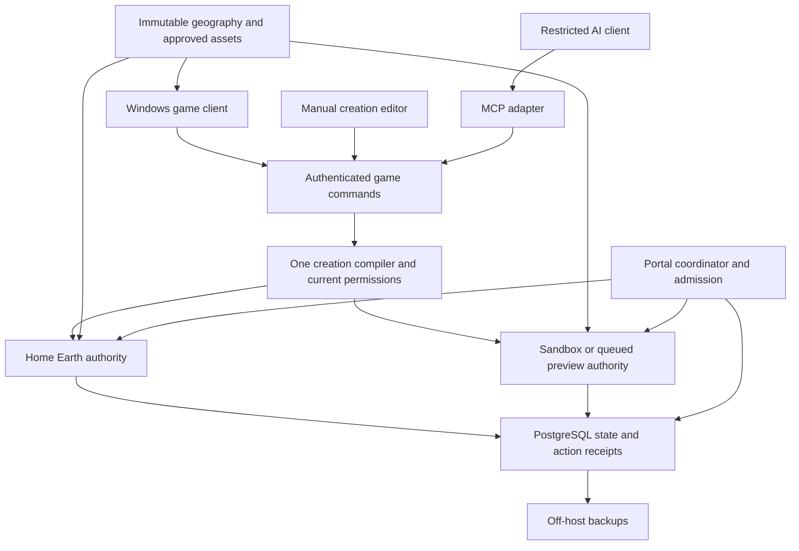
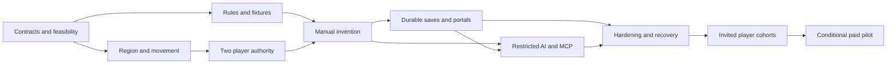

# Enfractal MVP roadmap

**Planning draft v0.2 — 1 October 2026; original baseline 30 September.** This plan turns the original conversations and subsequent direction into a staged project for one founder working with coding agents. It covers the map, rendering, art, engine/language, physics, AI/MCP, persistent Home Earth, invited sandbox worlds, subscriptions, and the product, security and operational work needed around them. The plan's budgets and performance gates remain proposals, not tested minimum-device benchmarks or launch commitments.

**Implementation update — 1 October 2026:** The [Barton Creek map and local workshop](../../maps/barton_creek/README.md) now combine the reproducible offline geographic package with a first [base-engine slice](../engine/first-slice.md). The slice adds a validated map runtime, terrain collision streaming, temporary first-person walking/jump/glide/recovery, and one bounded semantic platform with local save/reload. This work touches E01–E05 and an E07 movement subset; the shared-world authority, hosted durability, broader invention vocabulary and low-hardware performance gates below remain open. GDScript is provisional for this fixture; the proposed production Godot/C# choice still needs its native/headless feasibility check.

The first [photo-informed rendering pilot](../../maps/barton_creek/photo_pilot/README.md) adds a rights-documented Greenbelt material study and simplified mall-west treatment. This is a small visual pass; broad photo coverage, surveyed landmark reconstruction and target-device performance validation remain open.

**Product direction update — 1 October 2026:** The founder selected [grounded painterly 3D](../WORLD-VISION.md) as the long-term look and feel: recognizable, natural-scale places with warm, coherent materials and lighting, plus a structured world that remains editable and stylistically consistent after player changes. The [Greenbelt style study](../greenbelt-style-study.md) is an early material comparison, not a final art treatment. This direction supersedes the faceted-atlas recommendation in the dated option survey; the engine, exact shaders, asset recipes and performance budget still require measured implementation work.

The recommended first product is a small, geographically grounded shared region where players explore as creatures, invent through a bounded vocabulary, save work, invite friends to a free private version with different gravity, and return safely. Use this to validate the experience before expanding Earth's playable coverage. The long-term destination remains one shared Earth with persistent places and portals to independently configurable Earths.

The initial technical recommendation is **Godot + C#, grounded painterly 3D within measured graphics budgets, an authoritative headless server, geographic data streamed in bounded tiles, and an optional model-neutral creation assistant**. Confirm the engine/language choice with a capped experiment. The operating plan reserves at most **$95/month**, below the user's $100 ceiling. Revenue stays in the project, after operating obligations and a reserve, to fund further development.

## Read this plan in layers

| Document | What it answers |
|---|---|
| This roadmap | What to build, in what order, why, and when to stop or expand |
| [World and creation vision](../WORLD-VISION.md) | Confirmed end-product appearance, place identity and coherent, editable construction behavior |
| [Execution backlog](BACKLOG.md) | Bounded agent assignments, dependencies, ownership and evidence |
| [Global map](research/01-global-map.md) | Earth datasets, licensing, coordinates, tile hierarchy, editable geography |
| [Structured world and style system](research/11-structured-world-and-style-system.md) | Semantic parts, adaptive joins, versioned style recipes, edit validation and acceptance fixtures |
| [Performance and stack](research/02-performance-and-stack.md) | Seven stack alternatives, low hardware budgets, measurements and language tradeoffs |
| [Twelve visual styles](research/03-visual-style-options.md) | Art options, advantages, drawbacks, hardware load, flexibility and implementation languages |
| [Physics and creation runtime](research/04-physics-and-creation-runtime.md) | Existing engines, primitives, authoritative effects, constraints and invariants |
| [AI and MCP](research/05-ai-mcp-and-security.md) | Tool contracts, model neutrality, security, previews and inference spending |
| [Persistent Earth and portals](research/06-persistent-earth-and-portals.md) | State, partitions, free worlds, invitations, recovery and scale |
| [Business and reinvestment](research/07-business-costs-and-reinvestment.md) | Budget, free/paid services, price tests, unit economics and revenue use |
| [Product and release](research/08-product-community-and-release.md) | Gameplay, research, onboarding, accessibility, moderation, QA and distribution |
| [Maxar imagery assessment](research/09-maxar-open-data-assessment.md) | What the QGIS plugin provides, imagery rights, resolution, coverage and high resolution alternatives |
| [QGIS MCP assessment](research/10-qgis-mcp-assessment.md) | Agent-assisted GIS authoring, candidate repositories, experiment and boundary from player MCP |

The confirmed product direction in the world and creation vision governs art and construction goals; this roadmap governs MVP scope and staged delivery. Dated research examples remain alternatives, not competing goals. The detailed workstreams retain their reasoning and direct primary-source links. All capacities, timings, quotas and prices proposed for Enfractal are unmeasured targets or hypotheses unless explicitly described as observed hardware or a vendor quote.

## Confirmed requirements and working assumptions

The source conversations establish a playable Home Earth, a common enforceable ruleset, invention by combining supported operations, portals to personal worlds that can alter supported rules, and a model-neutral machine-readable interface. Designs may travel; permissions, currency and powers require destination validation. Technical resource limits remain outside the magic system. Copyable underlying software and compatible independently hosted destinations are strategic goals.

The user subsequently confirmed **planning only**, **one founder plus coding agents**, **early hosting and AI under $100/month**, and **paying-player revenue reinvested into development**. Those instructions govern the proposed scope. The attached conversations are product evidence, not independently verified competitor research; their old citation placeholders are replaced by primary sources in the workstream documents.

Working assumptions to revisit before implementation: native Windows first; Linux headless hosting; an invited adult research cohort; a third-person creature experience with adjustable camera; and modest avatar sizes before ant-to-continent scales. **Barton Creek at 30.250924, -97.810494 is the selected first map prototype**, and grounded painterly 3D is the selected long-term art direction. The exact MVP playable boundary, final style recipe, audience policy, code license and production engine version remain open.

Observed planning machine: i7-10875H, 8 physical/16 logical cores, approximately 32 GB RAM, RTX 2070 Super with 8192 MiB dedicated VRAM, and Intel UHD graphics. That inspection does not measure game performance or confirm which GPU a future build will use. Also target an actual 8 GiB integrated-graphics device. Testing with reduced RAM on the current machine cannot certify another device's GPU or memory bandwidth.

## The product to prove

The central question is whether a person can make an understandable invention that another person enjoys using, in a shared place worth returning to. A planetary flyover, a text-to-mesh generator or an attractive dragon alone cannot answer it.

The first fifteen minutes should work with AI disabled. Choose a creature, walk and glide through a ridge-and-garden route, operate a simple wind device in a contained workshop, change one part or parameter, help a consenting friend, and save an exhibit at a recognizable shared address. The garden is a protected landmark, not a new farming simulator. Returning tomorrow should reveal the same saved work.

The signature demonstration is a small storm dragon composed from ordinary capabilities: approved body, glide controller, bounded gust, sensor and cosmetic effects. It lifts a consenting friend, respects protected space, survives save/reconnect, enters a quarter-gravity sandbox, and returns with valid Home Earth state. Also test a stationary updraft, rescue pad, wind-driven spinner and sensor-light device. If the vocabulary only produces cosmetic variants of one dragon, improve creative depth before adding land.

### Required for a usable private MVP

- A roughly 2 × 2 km playable real-world region, derived from a buffered approximately 8 × 8 km source extract, with a coarse globe/atlas and explicit limits on playable coverage.
- Walk, jump, glide, safe recovery, readable forces, a small modular creature kit and a protected common space.
- Server-authoritative multiplayer, initially two players and later a measured cap up to eight people across Home plus one active sandbox.
- A manual template/parameter editor, supported component composition, preview, saved designs and shared consequences.
- One contained, structurally editable place-making fixture: an approved path/platform or small shelter edit whose join detail updates coherently, survives save/reload and remains revisable. This proves the visual system applies after change without promising arbitrary neighborhood remodeling.
- One optional AI creation path and a small MCP surface using the same authoritative commands as the manual editor.
- Durable shared edits, permissions, safe save/reconnect, backups and a tested recovery procedure.
- One free saved sandbox per invited account, up to four simultaneous occupants including its owner, controlled invitations, different gravity, and dependable Return Home.
- Bounded resource use, failure messages, report/block tools, basic accessibility, versioned release packaging and operator controls.

### Deliberately later

Whole-Earth detailed travel; globally excavatable terrain; true ant-scale and continental avatars; generalized material destruction or fluid simulation; high-speed vehicles; voice chat; unrestricted mesh/script/shader uploads; autonomous AI residents; real-money land trading; a marketplace/cash-out system; seamless live-rendered portals; mobile/VR/browser parity; and arbitrary third-party federation.

These remain roadmap tracks. They are excluded from the first delivery because each introduces a distinct performance, permission, content or operating problem. Free personal Earths start as regional personal worlds using the same global address model, not complete full-detail copies of the planet.

## Architecture and ownership

These are logical modules. Initially they live on one machine as a small number of processes, not independently scaled microservices. Home and sandbox need separate world identities, physics spaces and authority; using separate headless processes is a containment option within the measured host budget. A preview queues for or reuses the sandbox slot, or runs on the developer machine. It never quietly adds an unlimited third server.

| Boundary | Owner | Contract to freeze first |
|---|---|---|
| Geographic location | Map team | Double-precision Earth coordinates, units/datum, `WorldId`, `FrameId`, pinned base hash |
| Structured place | Map + creation + art | Stable semantic feature IDs, evidence/confidence, relationships, editable source and generator revisions |
| Terrain activation | Map + physics | Tile version, collision revision, visual revision and activation tick |
| Creation meaning | Physics/runtime | One capability registry, `CreationManifest`, compiled artifact and instance state |
| Placement and effects | Authority/runtime | Authenticated principal, target world/frame, permission revision, work reservation and action ID |
| Persistence | Home services | Durable receipt semantics, expected revision, migration and recovery behavior |
| Portal travel | Portal services | Logical-avatar uniqueness, transfer ID, capacity reservation, fencing epoch and safe-return checkpoint |
| AI access | MCP team | Explicit world/job/artifact handles, tool schemas and stable errors; no additional authority |
| Asset display | Art + rendering | Content hash, license/provenance, low-detail fallback and decoded/GPU cost ceilings |

Keep reusable blueprints in local coordinates. Placement commands carry global world/frame references. Keep map tiles, network interest sets, simulation cells and land parcels distinct. There is one canonical writable Home Earth at an address; queuing an arrival must not quietly create a second divergent copy of the garden.

## The map workstream

Use immutable versioned geography with sparse per-world edits. Natural Earth is suitable for the coarse overview; investigate a licensed Copernicus GLO-30 regional subset for elevation and optional WorldCover classification for broad biomes. Defer satellite imagery and imported city/building databases. Preprocess data during development, then distribute a bounded game package instead of depending on live map APIs during play. Dataset obligations and runtime-service terms are different. [Dataset selection and source links](research/01-global-map.md).

The Maxar Open Data QGIS plugin is valuable for inspecting selected disaster imagery at roughly 30–50 cm image resolution, but its imagery is CC BY-NC 4.0 and event-limited; the MIT plugin license does not license those images for a paid game. It supplies images, not terrain heights. If the first playable region is in the United States, assess public-domain NAIP imagery and unrestricted USGS 3DEP elevation at the exact location as a potentially stronger high resolution route. Keep the decision conditional on rights, contiguous coverage and client measurements. [Maxar and alternative source assessment](research/09-maxar-open-data-assessment.md).

QGIS MCP could let coding agents inspect and prepare licensed map layers inside QGIS during development. Test it on a small window after selecting a region; preserve a reproducible GDAL/PROJ build recipe and measure memory on the founder's machine. It is not a map source, a game renderer or the restricted MCP exposed to players. [QGIS MCP assessment](research/10-qgis-mcp-assessment.md).

The initial delivery hierarchy is a geographic quadtree with a separate local tangent-frame gameplay mesh. A cube-sphere remains an alternative if seamless polar traversal becomes a near-term requirement. Keep coordinates globally meaningful from day one, but do not build all high-detail tiles upfront. A 30 m source interpolated onto smaller triangles is still not measured centimeter terrain. Mark generated details as fantasy interpretation.

Handle vertical datum conversion, invalid source cells, tile seams, coast/water behavior, coordinate axes and coordinate-to-height round trips explicitly. Render LOD never changes authoritative collision. Preserve old base versions referenced by sleeping worlds and backups. Updating the source DEM cannot automatically move people's houses. Sandbox forks initially share the baseline geography and permitted templates, not unauthorized copies of Home Earth creations.

Milestones: one provenance-complete regional package; consistent render/collision seams; streamed neighboring patches; sparse edit save/reload; source-version migration fixture; a second geographically separated region; only then broader globe traversal. Initial packaging goal is below 250 MiB for the starting region, subject to measurement; reserve approximately 512 MiB of the application's 2 GiB disk cache for map work initially.

## Structured world and visual coherence

The [confirmed vision](../WORLD-VISION.md) requires three separable layers: evidence-backed geographic foundation, meaningful editable world parts, and a regional visual interpretation. A photograph or fused scan may be an input or a displayed asset; it is not automatically an editable building. Important structures need stable identities and parts such as walls, roof, openings and paths, with relationships and permitted operations. Store uncertainty and source/interpretation/player-change labels at useful object or feature granularity, not only at package level. [Detailed system direction](research/11-structured-world-and-style-system.md).

Player intent should invoke approved operations and deterministic detail generators. A path joining a terrace, opening in a wall, or watercourse meeting a bank should receive coherent transition details while the underlying parts remain individually editable. Keep generator version, seed, parameters, manual exceptions and rendered derivatives distinct. An edit that changes a join must invalidate and rebuild the affected visuals and collision at a controlled revision boundary; saved source objects remain the durable truth. Broad remodeling of existing cities, arbitrary excavation and automatic conversion of all scanned objects are long-term goals, not initial MVP capabilities.

The same creation compiler and authority validate manual and AI-assisted edits. Alongside physics and permission rules, a visual contract bounds material families, geometry, textures, effects, fallback detail and scene-wide cost. A machine can enforce hard limits and preserve provenance; it cannot certify that a café looks inviting or suits its neighborhood. Founder review and later player research evaluate those qualities. New component/generator families enter through reviewed extensions, not player-supplied executable shaders or scripts.

The first construction proof stays in a contained authorized plot: place or revise a small structure/path, regenerate one meaningful join, preview its look and cost, publish one durable change, reload it, and edit it again. Check the result at walking height and on the low graphics profile. A later end-to-end reference scenario may turn an authorized parking-lot parcel into terraces, a café, greenhouse and short stream while retaining neighboring buildings; that larger transformation should not be silently counted as an MVP acceptance gate.

## Rendering and language decisions

Godot + C# is the leading maintainability/open-code hypothesis. C# can serve client gameplay and the headless runtime; Godot's native engine handles rendering and physics. Use ordinary standard-precision builds with bounded local frames. Keep optional TypeScript confined to an MCP adapter if its maintained SDK materially helps. Do not start with a custom engine or parallel C#/Rust/C++ rule implementations.

The stack study compares Godot C#, Godot GDScript, Unity C#/URP, Unreal C++/Blueprints, Rust/Bevy, TypeScript/Babylon or Three.js, and Luanti C++/Lua. C# is not claimed to be the fastest language. Development efficiency, diagnostic tools, ownership of code, platform support and measured whole-frame performance matter together. Current Godot documentation excludes C# web export; browser-first gameplay would reopen the choice. [Detailed comparison and sources](research/02-performance-and-stack.md).

Cap the initial Godot feasibility spike at about 20 founder hours plus agent preparation: native/headless builds, one small terrain scene, movement/physics fixtures, measured resource use and ability to debug a simple change. Only run a further 8–12-hour Unity challenger if a specific blocker may be engine-related. Full portal recovery and multiplayer soak tests are later integrated gates, not prerequisites to completing a 20-hour spike. Stop after a candidate passes; do not build seven engines.

Use bounded disk/decode/GPU caches, hierarchical detail, culling, instancing, coarse distant proxies, small shared textures and a simple light model. Cancel stale downloads/decodes when traveling. No mandatory ray tracing, volumetric clouds, dynamic global illumination or live portal rendering. Graphics settings may simplify presentation, never authority, collision or readable warnings.

| Proposed acceptance target | Initial value | Evidence needed |
|---|---|---|
| Low device | 720p at 30 fps; warm p95 frame ≤33.3 ms and p99 ≤50 ms | Real 8 GiB iGPU device, release build, repeated routes |
| Current laptop | 1080p at 60 fps; p95 ≤16.7 ms and p99 ≤25 ms; optional 30 fps cap | Confirm RTX selection and sustained thermal behavior |
| Low-device memory | ≤2.5 GiB attributable CPU/shared-GPU envelope | Separate private/commit/shared-memory records without double-counting |
| Laptop memory | ≤4 GiB private client memory and ≤2 GiB initial GPU allocation | Peak, settled and long-session measurement |
| Server | Candidate 8 GB-class host; simulations ≤3 GiB, DB/gateway ≤1 GiB; adapt OS/cache to actual usable bytes and preserve ≥2 GiB reserve by lowering other caps | Actual usable bytes and simultaneous-world/cold-load measurements |
| Cadence | 30 Hz authority, 15 Hz nearby snapshots | Movement/contact tests; test 60 Hz physics only if needed |
| Server tick | p95 ≤20 ms and p99 ≤30 ms | Eight-person combined stress scene, not an empty region |
| Network | Average ≤30 KiB/s gameplay outbound per player; p95 ≤60 KiB/s | Loss/reorder tests and measured player-hours; tiles accounted separately |
| Stability | Two-hour client soak, later overnight server soak | No crash or unbounded growth; recovery and resource eviction evidence |

Vendors may label RAM in GB while operating-system tools report GiB. Measure the purchased configuration's actual usable memory and preserve reserve; the table is a proposed 8 GB-class allocation, not a promise that every quote provides exactly 8 GiB. If the host cannot pass, lower work/admission ceilings before increasing spend.

## Art direction and earlier graphical options

The **selected goal is grounded painterly 3D** as defined in the [world and creation vision](../WORLD-VISION.md): natural proportions, softly sculpted but recognizable forms, controlled material variation, gentle lighting, local biome and architectural identity, and a welcoming walking-height view. The table below is the earlier option survey. Its ratings are qualitative engineering judgments, not benchmarks, and no style requires one gameplay language. The listed paths remain useful for implementation tradeoffs rather than a vote to replace the confirmed direction.

| Style | Hardware strain | Strength and flexibility | Main drawback | Practical coding/shader path |
|---|---|---|---|---|
| Faceted illustrated Earth | Low | Easy procedural geography, modular shapes and palette reuse | Repetition or weak silhouettes can look unfinished | Godot C#/GDScript + vertex colors; Unity C# equivalent |
| Soft toon | Low–medium | Expressive unusual creatures and readable motion | Outlines/extra passes and light-band artifacts | C#/GDScript + Godot shader; Unity C# + HLSL/graph |
| Painted storybook | Medium textures | Warm identity on simple geometry | Painting/UV labor and inconsistent new assets | C#/GDScript with simple lit shaders and painted assets |
| Clay miniatures | Medium | Coherent rounded, assembled creatures | Mesh/sculpt labor; realistic soft lighting costs | C#/GDScript + rough opaque materials |
| Papercraft | Low–medium | Distinctive folded shapes and inexpensive textures | Thin surfaces fail under free aerial cameras | C#/GDScript + opaque mesh materials |
| Block voxels | Medium CPU spikes | Intuitive building and combinatorial construction | Remeshing/storage; grid constrains organic shapes | C#/GDScript chunk meshing; native hot path only if measured |
| Smooth voxels | High CPU/meshing | Organic excavation, caves and sculpting | Collision rebuilding and persistent volumes greatly expand scope | C# or C++/Rust meshing plus engine shaders |
| Retro textured 3D | Low GPU | Deliberate low-resolution look with flexible objects | Tiny details/readability and optional wobble discomfort | C#/GDScript + low-resolution target/palette shader |
| Sprites in 3D | Low–medium CPU, medium–high overdraw | Illustrated creatures and economical distant proxies | Free rotation/custom animation multiplies sprite work | C#/GDScript + billboard/atlas shader |
| Living topographic atlas | Low–medium | Strong Earth identity and wayfinding | Contour shimmer/label clutter; less embodied feeling | C#/GDScript + contour shader and label logic |
| Restrained realistic PBR | High | Recognizable places and broad visual range | Textures, foliage, lighting and art consistency | C# in Godot/Unity or C++ Unreal + standard PBR |
| Procedural implicit creatures | High shader cost unless baked | Compact descriptions and unusual blended shapes | Collision/animation/LOD separate; screen coverage expensive | Godot shader/HLSL with C# orchestration; bake meshes where possible |

The [Greenbelt style study](../greenbelt-style-study.md) has compared three small material/lighting treatments on the same source-derived map. None yet achieves the finished grounded painterly direction: the trees, rocks and building proxies remain illustrative, and the scene lacks semantic editing and adaptive construction joins. Next, author one convincing walking-height reference scene with regional materials and natural-scale silhouettes, then test a small editable structure and its regenerated details. Keep the twelve options as historical tradeoff research, not twelve production pipelines. [Full options and pros/cons](research/03-visual-style-options.md).

## Physics and creation language

If Godot is selected, use its existing Jolt integration; test specific joint/contact caveats instead of assuming every exposed setting works. Keep a Godot Physics comparison for a reproducible Jolt issue. Unity/PhysX, Rapier and Unreal/Chaos remain whole-stack alternatives, not simultaneous dependencies. [Physics comparison and primary documentation](research/04-physics-and-creation-runtime.md).

The shared vocabulary starts with a capsule avatar, approved rigid shapes, fixed/hinge attachments, walking/jumping/gliding, bounded wind, limited sensors, a small material palette and cosmetic effects. Terrain mutation is a later bounded workshop operation. A graph combines these; it cannot install a new engine capability by naming it. Publish the units, supported parameters and stable error messages.

Initial proposed ceilings: 16 total behavior nodes, eight dynamic bodies and eight joints per creation; five trigger activations per second; bounded fields up to eight meters, two seconds and eight permitted targets. The whole initial host shares a ceiling of 128 awake props, 32 joints and 16 fields across Home, sandbox and previews. These are profiling workloads, not guaranteed allowances for every person simultaneously. Actor/region/host quotas override per-object legality.

Use one authoritative outcome and limited client prediction; do not depend on all machines producing identical rigid-body simulation. Public structures are immutable. Avatars cannot shove others by default. Friendly lift effects require consent; dynamic contraptions operate in contained opt-in workshops. General arbitrary boulders crossing property boundaries are excluded until their indirect effects can be safely enforced. Attribution alone is not protection.

The creation language, compiler and runtime share one owner. The AI team is a compiler consumer, not a second compiler author. Test malformed data, cycles, causal feedback, NaN values, old commands, revoked permissions, overlapping actions and quota splitting. The immutable compiled artifact is not an eternal permission grant; each consequential effect still checks current state.

Encourage surprising combinations within published rules. Provide a separate bounded test environment for reproducible exploit reports and stress experiments; do not reward crashing an occupied Home region. A discovery that yields fictional energy still remains inside its computation allowance. This distinction should appear in community rules and creator feedback.

## Persistent Home Earth and portals

Use one PostgreSQL database for durable metadata/receipts and immutable asset/map blobs for large content. Commit acknowledged placements, ownership changes and transfers durably; snapshot motion rather than writing every frame. Empty geography is saved, not continuously simulated. Empty sandbox workers checkpoint and stop. No offline replay of millions of physics ticks.

Partition future activity by authority cells, independent of geographic delivery tiles or parcels. A crowded garden remains a hot-spot problem even if the globe is enormous. Begin with admission caps and queues. Later test two authority workers with whole-assembly handoff; no cross-worker rigid joints in the MVP. Never promise infinite players in one location.

A free sandbox initially has one saved state, about 100 MiB of proposed compressed user deltas/assets, an owner plus up to three visitors, and a shared service-wide session slot. Quotas also limit decoded size, object count and simulation work. Start with a 20-account cohort, not an open registration flood. Use fair, scheduled sessions; when another owner waits, a provisional one-hour allocation ends with warning/save/return. Free saves persist while sleeping. No paid tier bypasses client or server safety limits.

Portal transfer is a durable state machine: request and reserve; validate destination; checkpoint/freeze source; atomically move authority to a new epoch; materialize destination; acknowledge/recover. One logical avatar is unique across all login sessions. Unknown commit outcomes freeze and reconcile by transfer ID; timeout is never proof that it is safe to re-create the source avatar. Recheck invitations, blocks, rule hash, capacity and destination readiness at commit. A late denial triggers a new fenced return. The Home server must support all eight admitted players returning.

Returning restores valid Home state. Blueprints can travel with permission and provenance, minting destination-local instances. Private powers, possessions and economic claims cannot become Home authority. Main credentials and model keys never go to a destination. Portals initially connect same-operator worlds; independent federation follows a separate compatibility/security milestone. [Detailed transfer design and failure cases](research/06-persistent-earth-and-portals.md).

## MCP and AI integration

Roblox supplies useful but distinct precedents: Studio MCP supports development tools, while its 4D generation describes schema-based functional generation inside experiences. Borrow the inspect, propose, test and revise loop; do not expose developer execution tools to public players. AI/MCP alone is not the proposed differentiation. [Roblox Studio MCP](https://create.roblox.com/docs/studio/mcp), [Roblox 4D generation](https://about.roblox.com/newsroom/2026/02/accelerating-creation-powered-roblox-cube-foundation-model).

The proposed adapter describes world rules, lists capabilities, validates a creation, schedules preview, reads/cancels owned jobs, prepares publication, publishes an approved artifact, and exports an authorized design. No `eval`, arbitrary file reads, shell, SQL, arbitrary URL fetching or ownership-grant tool. Manual controls and AI invoke the same game API. Publication review binds the exact artifact, destination and revision.

Start with local stdio for a restricted creation client; hosted MCP later uses maintained standard authorization/transport libraries and explicit compatible versions. Protocol, game schema and world-rule versions are separate. Pin a tested SDK and clients rather than copying an old tutorial. High-frequency movement uses normal game networking, not MCP. [Integration details and current specification links](research/05-ai-mcp-and-security.md).

Use at most $15/month of incremental AI, with up to $10 for in-game creation and the remainder for extra development API work. Cap attempts, context/output, deadlines and worst-case billing reservation before calls. Existing subscriptions do not automatically cover game API usage. Manual building and basic play continue when AI is unavailable. Model/provider selection comes from a small fixed evaluation, not speculative benchmarks.

Autonomous avatars are a later mode with a separate identity, visible badge, high-level intentions, limited area/time/action grants and a stop control. They cannot inherit the developer assistant's file/email/spending privileges. A third-party assistant may already have broad privileges, which our server cannot remove; official hosted avatar mode must use a restricted agent environment.

## Parallel agents without an unmanageable project

The requested teams become **12 workstreams**, staffed in bounded waves. This planning pass used five specialist agents in parallel and then independent cross-review, with the coordinating agent integrating persistence, business and the roadmap. Future implementation should generally run two or three coding agents plus one independent reviewer; the founder remains the product owner and integrator. Five agents can produce changes faster than one person can responsibly understand them.

| Workstream | Builder/research responsibility | Independent review responsibility |
|---|---|---|
| 1 Map/data | Source pipeline, geography and provenance | Datum, seams, license and distribution checks |
| 2 Rendering | Streaming, culling, residency and low settings | Cold/warm/thermal/memory measurements |
| 3 Art | Style, modular assets and readable effects | Accessibility and cost at low settings |
| 4 Stack/tooling | Engine decision, builds and dependencies | Reproduce native/headless builds and licenses |
| 5 Physics/runtime | Movement, compiler and supported effects | Indirect permissions and generated invariant tests |
| 6 Networking | Commands, interest management and prediction | Loss, reorder, forged inputs and bandwidth |
| 7 Home persistence | Durable receipts, saves, parcels and recovery | Crash/migration/restore/duplicate-action tests |
| 8 Portals/sandboxes | Invitations, lifecycle, admission and transfer | Unknown commits, stale epochs and safe-return faults |
| 9 AI/MCP | Restricted adapter and inference workflow | Prompt injection, handle access, budgets and compatibility |
| 10 Product/community | Loop, onboarding, moderation and cohorts | Independent playability/accessibility observations |
| 11 Business | Service tests, accounting and later billing | Entitlement failures, actual margins and capacity promises |
| 12 Release/operations | Packaging, telemetry, deployment and incident tools | Fresh-machine install, soak, rollback and restoration |

Each assignment gets a short context bundle: requirement, contract version, files owned, accepted inputs/outputs, forbidden scope, acceptance evidence and stop condition. Use isolated worktrees once a repository exists. Never let several agents independently edit the same schema, tick loop or migrations. Shared contracts change through a short reviewed decision. One human integrates small changes and reruns the relevant checks.

Before distributing code, choose a coherent open-source license and separate licenses/notices for the specification, original assets and geography. MIT or Apache-2.0 are candidates for permissive copying; the decision needs a dependency compatibility check and a founder choice about contributions. [MIT text](https://opensource.org/license/mit), [Apache-2.0 text](https://www.apache.org/licenses/LICENSE-2.0). Publish supported capability profiles and conformance fixtures without claiming a universal standard. Maintain a security-reporting contact and a policy for contract-breaking releases; forks may be compatible destinations, but do not inherit Home Earth's authority or reputation.

Parallelize map preparation, art fixtures and pure-domain rules after interfaces freeze. Networking and persistence can develop against shared fixtures. Portal code depends on durable identity/presence; AI publishing depends on the actual compiler and permissions. Review agents may prepare adversarial cases before implementation, but cannot claim to have tested code that does not exist.

## Phases and exit gates

Founder-hour estimates below cover hands-on implementation oversight, integration, debugging and milestone checks with agents assisting. They are planning ranges, not measured velocity. Do not convert agent count directly into equivalent full-time developers. Recurring community operation later adds approximately 4–6 hours per week. Gates may overlap where dependencies allow.

| Phase | Proposed founder hours | Work that can run in parallel | Exit evidence |
|---|---:|---|---|
| 0 Feasibility and contracts | 25–45 | Engine spike; dataset/license sample; primitive examples; player/competitor research | Native/headless viability, location/style shortlist, versioned contracts, explicit stop risks |
| 1 Place and movement | 35–70 | Regional terrain; controller; minimal art/UI; profiling harness | Recognizable region, seams/collision, safe glide, bounded cache and useful low profile |
| 2 Shared consequences | 50–100 | Network commands; world authority; basic identity; independent network tests | Two remote clients agree on wind/glide; forged/replayed inputs fail; measured traffic |
| 3 Manual invention | 60–110 | Single compiler; editor; contained workshops; permissions review | Non-AI creation, combinatorial inventions, precise errors and bounded work |
| 4 Save and travel | 60–110 | Durable state; sandbox lifecycle; invitation UI; transfer/recovery tests | Shared saves survive restart; changed-gravity visit/return; fault suite and off-host restore |
| 5 Optional AI/MCP | 30–60 | Adapter; inference evaluation; publication UX; security review | Two clients use restricted tools; AI on/off path; bounded billing; no additional privileges |
| 6 Integrated hardening | 60–120 | Performance/soak; accessibility; moderation; release packaging | Eight-person target or declared lower cap passes; startup/cold-world peaks; no blocker invariants |
| 7 Private product alpha | 40–90 | Paired sessions; issue fixes; retention and cost analysis | Ten-tester pilot then 20-person activated cohort; four weeks of real opportunity to return |
| 8 Optional paid pilot | 35–75 additional | One service package, billing tests, operating/terms review | Actual demand, reliable service, cancellation, budget and refund readiness |

Phases 0–7 total **360–705 founder hours** before contingency. A 30–50% uncertainty allowance makes a planning envelope roughly **470–1,060 hours**. At 15 focused project hours weekly, that is roughly **7–16 months**, with operations or learning time potentially extending it. A first two-client technical proof can arrive much earlier than the full private MVP. These figures should be replaced after the first two work cycles; if the founder is learning the engine/networking from scratch, expect the upper range or reduce scope.

Do not buy months of hosting while the prototype can run locally. Begin paid hosting when remote tests require it. Phase 8 also depends on actual cohort calendar time and any professional-review cost; it is not a guaranteed paid launch after a specified number of coding hours.

The critical path is supported capabilities → shared authority → durable identity/state → safe portals → integrated reliability → repeat use. World coverage, art polish and more AI features must not consume all effort while that chain remains unproven.

## Acceptance that determines release

| Area | Required proof before expanding access |
|---|---|
| Product | Complete solo and cooperative loop without AI; people can explain what they changed and why it worked |
| Invention | Multiple functional combinations beyond a prescribed dragon; no special-case code for every named creature |
| Authority | No duplicated logical avatar/possessions, permission amplification, cross-world state leakage or double-applied retried action |
| Physics | Containment, consent revocation, safe movement and bounded causal chains; graphics cannot alter outcomes |
| Persistence | Acknowledged durable edits survive process crash; off-host restoration works; known disaster-loss window disclosed |
| Portal | Failure/retry at every state, concurrent reconnect, revoked invitation and unavailable destination all recover safely |
| Low hardware | Profile targets or honestly reduced supported content/quality; real iGPU test before claiming that minimum |
| Whole-host load | Home plus sandbox and preview scheduling fit together, including cold load and all-player return |
| AI | No secrets/unrelated privileges; guessed job IDs fail; inference cap holds under retries; manual fallback works |
| Transport and research data | Maintained authenticated encryption/server identity checks for both gameplay and control traffic; tester notice, minimal collection and retention/deletion choices ready before enrollment |
| Community | Report/block/revoke/quarantine/appeal procedures, basic accessible flows and manageable founder workload |
| Cost | Actual billed and reserved spend stays under $100; no unchecked autoscaling or indefinite model loops |

Use unit tests for pure coordinate/schema/budget functions; integration tests for server authority and durable state; generated state-machine sequences for chained failures; real release builds for performance; humans for enjoyment and clarity. Independent tests derive from the contract, not a rewrite of the implementation. Passing tests is evidence of the tested cases, not a proof of unlimited safety or scale.

Do not expand with unresolved duplication, corrupt saves, unsafe transfer, privilege escapes, uncontrolled billing or repeated crashes. Low generation quality can ship as an optional limited feature; low creation quality or an uninteresting Home world requires product work before monetization.

## Free access paid services and reinvestment

| Monthly allocation | Ceiling |
|---|---:|
| Candidate host | $55 |
| Backups and object/map storage | $6 |
| All incremental AI | $15 |
| Domain amortization | $2 |
| Monitoring/incidental tooling | $2 |
| Tax/IPv4/usage uncertainty reserve | $15 |
| **Total** | **$95** |

This is a spending allocation, not a tested hosting quote. The researched CCX13 example lists 8 GB and two dedicated vCPUs, with US pricing of $50.99 before IPv4/tax; verify actual availability, included transfer and workload before purchase. A cheaper 4 GB quote does not satisfy the proposed memory envelope. [Plan specification](https://www.hetzner.com/cloud-singapore/), [current price table](https://docs.hetzner.com/general/infrastructure-and-availability/price-adjustment/).

Existing subscriptions, wages and existing equipment are excluded; new metered development AI is included. If the $100 is intended to cover existing subscription bills, subtract those first. Annual domain cash expenses count in their actual month. Sleeping sandboxes reduce simulation load, not the bill for an allocated VPS. Exact accounting, fees and sensitivities appear in the [business study](research/07-business-costs-and-reinvestment.md).

Offer free exploration/manual creation and bounded saved sandboxes first. Consider one $8–$12/month creator-service pilot only after repeat use, explicit interest in a specific working benefit, reliable persistence, measurable cost and tested cancellation. A proposed small-cohort gate is six of 20 activated testers returning in week four and five expressing concrete willingness to purchase; use counts and interviews, not a claim of statistically established product-market fit.

Paid benefits are more saved projects, measured storage, restoration/version history or reserved session time, not exemption from shared rules. Define actual bookable hours/seats before selling reservations. Keep free access meaningful. Avoid annual/lifetime promises, land speculation and marketplace payouts at this stage.

Retain all proceeds for the project. First cover payment/refund/tax obligations, committed operation and a three-month operating reserve; invest remaining funds in measured bottlenecks. Small recurring revenue can buy targeted specialist reviews, asset work or more compute, but does not yet pay a developer salary. Do not increase recurring spend against projected future subscriptions.

## Risks and decision responses

| Risk | Early signal | Response and owner |
|---|---|---|
| Planet scope consumes the project | Detailed globe demo but no shared invention | Founder keeps one region until creative loop and persistence gates pass |
| Low hardware fails | Persistent frame/memory misses on real minimum device | Renderer reduces effects/residency and creation density; revisit style before rewriting engine |
| Creator freedom is shallow | Players only recolor one preset | Product/runtime add one well-tested compositional primitive or challenge |
| Unsafe indirect physics | Props or momentum bypass protected space | Physics narrows shared effects/containment; defer broad destructive interactions |
| Host cannot support two worlds | Tick misses or cold-start memory spikes | Operations lowers combined quotas/capacity, schedules sessions, reevaluates within budget |
| Free sandbox queue is unusable | People cannot visit within available evenings | Founder adjusts cohort/session windows before adding registrations |
| Persistence/portal loss | Unknown commits, duplicate avatar or unrecoverable save | Stop rollout; fix fenced state machine and reproduce recovery |
| AI costs or errors grow | Repeated repairs, large prompts, provider bills | Cap attempts, reserve charges, improve templates; manual path remains |
| Solo review bottleneck | Large agent changes nobody understands | Smaller file-owned tasks; two builders plus reviewer; reject unexplained dependencies |
| Moderation displaces development | Support consumes available founder hours | Smaller invited community, fewer communication/upload features, staffed windows |
| Data/asset rights unclear | Source release cannot be redistributed or exported | Map/art replaces source and preserves provenance before content production |
| Monetization distorts design | Selling land or concurrency ahead of value/capacity | Business waits for retained use and a costed service |
| Proprietary ecosystem lock-in | Core rules stored only in engine scenes or provider prompts | Versioned neutral schemas, export fixtures and replaceable adapters |

Before public access, schedule appropriate professional review for audience/privacy, recurring billing, content rights and moderation responsibilities. This is a named cost/work dependency, not an assertion that a generic template or adult-only label solves legal duties. Do not silently launch publicly if that dependency is unfunded.

## Expansion after evidence

1. **More places:** a second licensed region and reliable travel; then automated geographic packaging, broader procedural coverage and polar/seam tests. Publish separate metrics for mapped area, playable area and simultaneous users.
2. **More invention:** add a small capability with semantic, budget, permission and migration tests. Terrain digging, vehicles and new materials are each their own project.
3. **More scales:** introduce an explicit habitat/proxy model and authoritative cross-scale effects; test two scales before approaching ants and giant creatures.
4. **More people:** measure 8, 16 and 32 in one area; split independent authority cells only after handoff and operating costs justify it. Persistent canonical Home state remains singular.
5. **More personal worlds:** add saved-world capacity and active workers funded by measured demand; optional self-hosted/exported destinations after conformance tools exist.
6. **AI inhabitants:** restricted identities, high-level intents and visible stop controls after live-world safety and cost evidence.
7. **Federation:** allowlisted external operators first, versioned conformance tests and credential isolation; no assumption that all copied servers share Home authority.
8. **Broader platforms/services:** browser atlas/editor, Linux/macOS clients, gamepad/mobile/VR evaluation, group hosting and optional marketplace only when justified.

## First playable slice and next work session

The Barton Creek local workshop is the first implementation fixture across E01–E05 and E07. It exercises package validation, terrain and collision seams, walking-height movement and one manually editable, locally saved object. The [integrated local checks](../engine/first-slice.md) pass; inspect the route and placed object at walking height, and record renderer, frame time and memory before treating this slice as accepted. The current machine's dedicated GPU cannot establish the proposed 8 GiB integrated-graphics minimum.

The next work cycle should close the native/headless export and low-device measurement questions, improve the grounded painterly 3D walking-height art fixture, and define the authoritative command boundary that could promote local manual edits into shared Home Earth state. Remote player agreement, durable hosted receipts, private-world portals and AI/MCP creation remain later gates. Update estimates from measured evidence instead of treating this local fixture as an MVP release.
