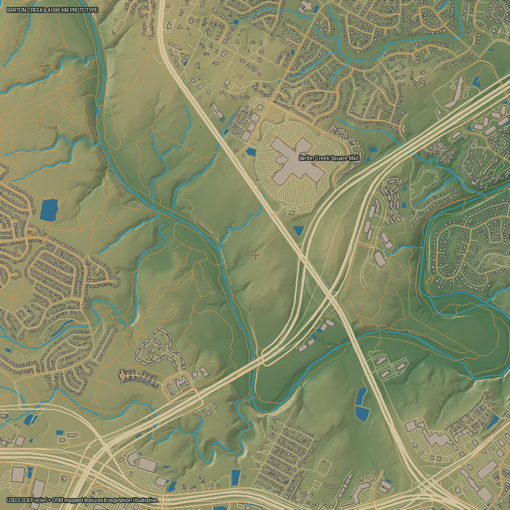
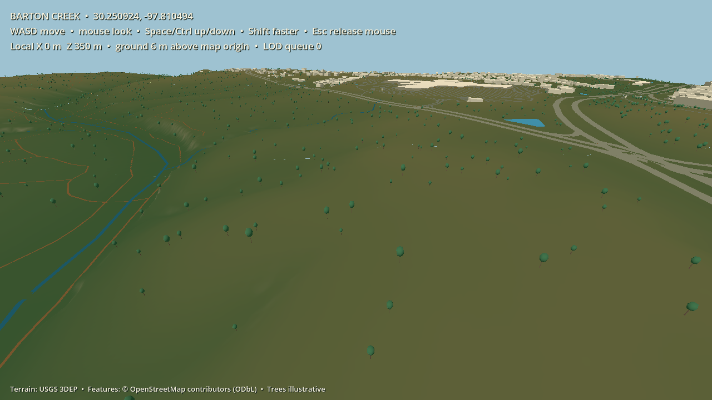
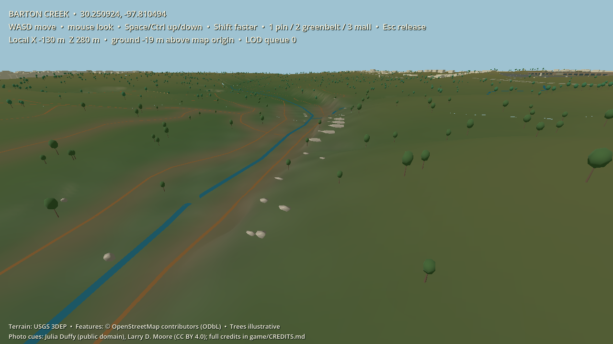
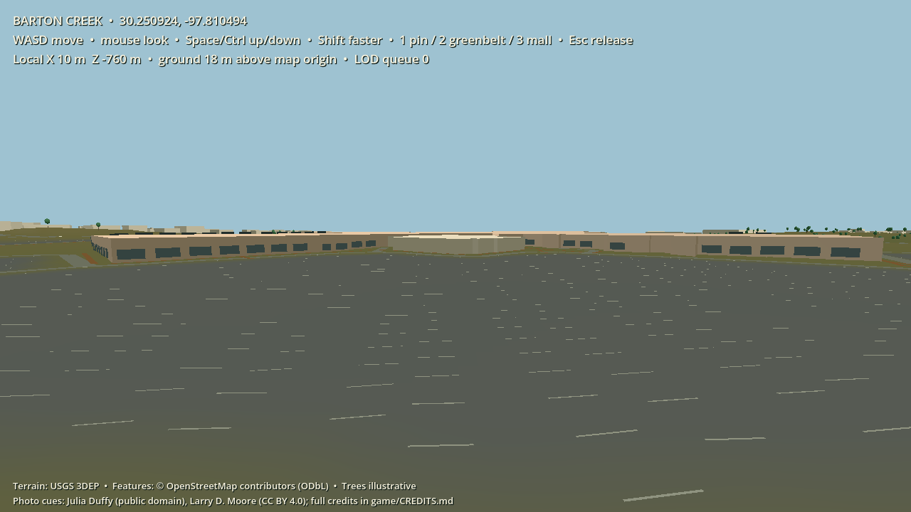

# Barton Creek first-map prototype

This is the first concrete EnFractal map package, centered at the founder's pin **30.250924, -97.810494**. It covers a **4.096 × 4.096 km** square in WGS 84 / UTM zone 14N (EPSG:32614), including the mapped Barton Creek Square Mall footprint, the MoPac and South Capital of Texas Highway area, nearby greenbelt terrain, trails, creeks and surrounding buildings. The center pin is the local origin; +X is east and +Z is south.





The [photo-informed pilot](photo_pilot/README.md) adds small rendering studies at the mapped Greenbelt trail and mall west side:





The [Greenbelt visual style study](../../docs/greenbelt-style-study.md) compares three editable material and lighting recipes on the same photo-guided area.

## What was built

The offline Python map builder fetches a bounded USGS 3DEP bare-earth elevation image and a four-part OpenStreetMap snapshot. It checks source coverage, CRS, bounds, raster validity and hashes; transforms selected OSM ways into local metric coordinates; and emits a versioned package. The output has a 2 m elevation sample grid, a top-down preview, mapped line/polygon features and deterministic representative trees. A second offline stage reads [two rights-checked photo references](photo_pilot/README.md), validates their hashes, samples local color ranges and emits compact material masks and visual cues. The Godot 4.7 viewer builds 512 m terrain tiles from the shared grid and changes mesh density by camera distance. Roads, trails, creeks, water areas and simple building/tree geometry provide an initial 3D read of the area. The viewer uses the Compatibility renderer and requires no map API or AI call while running.

The generated files are checked into the repo under [`game/maps/barton_creek`](../../game/maps/barton_creek). The exact fetched source responses are archived under [`sources`](sources), with [source URLs, retrieval times, checksums and limitations](sources/sources.json). That allows local rebuilds without another download and prevents a changing web service from silently altering this initial package.

## Open the map

Godot 4.7.2 is already on the development laptop. Run [`run-map.ps1`](../../run-map.ps1) from the repository in PowerShell to open the map; it finds the existing copy in Downloads. For the fixed Greenbelt style viewpoint, run [`run-style-study.ps1`](../../run-style-study.ps1). If Godot is elsewhere, set `ENFRACTAL_GODOT` to its executable path, or open [`game/project.godot`](../../game/project.godot) directly in Godot. On another computer, use the official [Godot 4.7.2 standard build](https://godotengine.org/download/archive/4.7.2-stable/) for Windows. Keyboard: **W/A/S/D** move, mouse looks around, **Space/Ctrl** move vertically, **Shift** moves faster, **1** returns to the pin, **2** jumps to the Greenbelt pilot, **3** jumps to the mall pilot, **4/5/6** select the atlas/storybook/natural styles, and **Esc** releases the mouse. This is a free-fly inspection camera, not yet player movement or world physics.

To verify or rebuild the already archived package with Python 3.12:

```powershell
py -3.12 -m venv .venv
.\.venv\Scripts\python.exe -m pip install -r requirements-map.txt
.\.venv\Scripts\python.exe -m mapbuilder verify
.\.venv\Scripts\python.exe -m mapbuilder build
```

The `fetch` action is only needed for a **new** source snapshot and refuses to overwrite an existing nonempty source directory. For a new date, supply `--sources` with a new directory, review source rights and coverage, then build deliberately. Do not run data downloads every time the game starts. The checked-in package is enough to explore the area.

## Data rights and accuracy

- **Elevation:** [USGS 3DEP dynamic bare-earth service](https://elevation.nationalmap.gov/arcgis/rest/services/3DEPElevation/ImageServer), sampled here on a 2 m grid inside an area shown in the [1 m availability index](https://index.nationalmap.gov/arcgis/rest/services/3DEPElevationIndex/MapServer/1). [USGS says 3DEP products are free without use restrictions](https://www.usgs.gov/3d-elevation-program/about-3dep-products-services). The archived service response, rather than an individually identified original DEM tile, is the source of this build. USGS's independent point query at the center returned 203.807 m; the package's sampled center is 203.79 m. This is a useful cross-check, not a survey-accuracy claim.
- **Mapped features:** [OpenStreetMap](https://www.openstreetmap.org/copyright), © OpenStreetMap contributors, Open Database License 1.0. The raw OSM extract and derived [`features.json`](../../game/maps/barton_creek/features.json) are provided as a separate ODbL database. See [source credits and redistribution notes](sources/COPYING.md).
- **Vegetation:** 5,000 deterministic trees are illustrative, informed by mapped greenery, creek proximity, developed areas, roads and slope. They do not identify surveyed individual trees or species.
- **Buildings:** Mapped footprints are used for the 2D preview. The 3D viewer extrudes large named landmarks from their mapped outlines and uses cheap oriented box proxies for other buildings. Untagged building heights are guesses; overpasses and ramps use visual approximations because the road centerlines do not contain surveyed deck elevations.
- **Photo references:** A [public-domain Greenbelt photograph](https://commons.wikimedia.org/wiki/File:BartonCreekGreenbelt.jpg) by Julia Duffy and a [CC BY 4.0 mall exterior photograph](https://commons.wikimedia.org/wiki/File:Barton_Creek_Square_Mall_Austin_Texas_2020.jpg) by Larry D. Moore guide color and simplified appearance in two pilot zones. The images are not projected onto the scene. The mall glazing pattern, Greenbelt shelf and rocks, and parking stall paint are illustrative. [Full credits](../../game/CREDITS.md) and [reproducible evidence](photo_pilot/evidence.json).

The exported raster is projected in meters for this map. The dynamic image response does not pin the original tile's vertical datum or project metadata. USGS says 3DEP DEMs commonly use NAVD88, but that general statement is insufficient for global-coordinate placement; this prototype uses heights **relative to the local center**. Before Home Earth persistence or physical gameplay, identify the underlying product metadata, settle vertical datum conversion, verify trails and creek crossing geometry, and build collision surfaces that match the visible terrain. [USGS datum FAQ](https://www.usgs.gov/faqs/what-projection-horizontal-datum-vertical-datum-and-resolution-a-usgs-digital-elevation-model).

No Maxar image, commercial satellite mosaic or live web basemap is included. The screenshot proves the scene renders on the development machine; it is not a benchmark for the roadmap's 8 GiB integrated-graphics target. The next performance gate must measure frame time, RAM, GPU memory and movement through the area on that profile before raising detail.

## Package contract

[`manifest.json`](../../game/maps/barton_creek/manifest.json) defines the world extent, grid spacing, coordinate axes, local height origin, quantitative height decode and file hashes. `heights.r16` is a row-major little-endian `uint16` grid of 2049 × 2049 *shared vertices*. Decode metres as `height_offset_m + sample × height_scale_m`; subtract `height_origin_m` for local Godot Y. The quantization step is storage precision, not claimed measurement accuracy. Every LOD tile samples the same grid at common boundaries. `features.json` is a separate ODbL geospatial feature database. `photo_pilot.json` and `photo_overlay.png` hold the small photo-guided visual layer; the parking line coordinates in that layer are also derived from OSM. The package is immutable; future player changes will be sparse state layered over its versioned ID.

The current map builder is a useful first implementation, not the whole Earth engine. It works with a region configuration and USGS/OSM source adapters; it does not yet stream multiple regions, implement persistent edits, or authorize multiplayer. QGIS MCP may later help inspect source layers, but it is not required to build or run this map.
