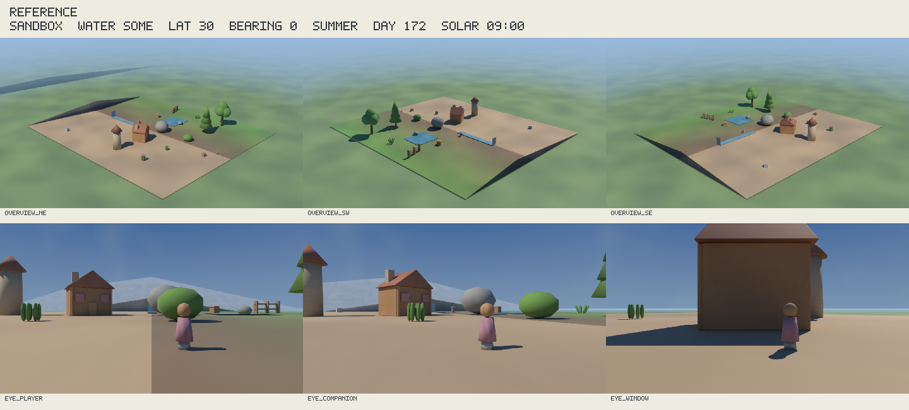
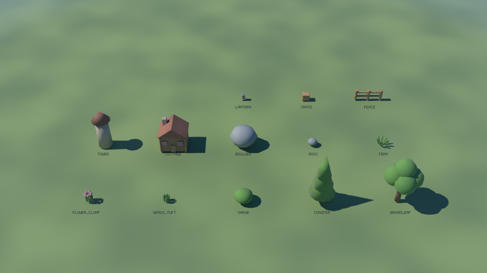

# Shared landscape render harness, v1

This is the common judging renderer for both landscape generators. It consumes
synthetic room manifests and landscape packages, never photographs. It supplies
materials, a small geometry kit, manifest cameras, a solar sky, fixed CPU settings
and a blind sheet. It is offline author tooling, not a companion capability or a
game command host. The reference is a sparse format fixture, not a design target.
Only the founder judges the look and whether a contender feels like land.



## Write, validate, render

Run from the repository root. Do not use unittest discovery's `-s pipeline`: the
repository's `pipeline/` is a namespace package. Python's standard library is the
only dependency outside Blender; no global installation is needed.

```python
from pathlib import Path
from pipeline.landscape.harness import write_package, read_package
from pipeline.landscape.harness.common import load_json

room = Path('pipeline/landscape/corpus/rooms/garage_nominal')
setup = load_json('pipeline/landscape/harness/ab-setup.json')
# Lists, metres, +Y up, -Z forward; counter-clockwise from the visible side.
land = dict(role='meadow',
            positions=[[-3, 0, -3.5], [-3, 0, 3.5],
                       [3, 0, 3.5], [3, 0, -3.5]],
            triangles=[[0, 1, 2], [0, 2, 3]])
write_package('my-empty-package-folder', room,
              meshes={'land': [land]}, setup=setup,
              generator={'name': 'my-generator', 'version': '1'},
              terrain=[{'mesh': 'land'}])
doc, meshes, manifest, stats = read_package('my-empty-package-folder', room)
```

The writer requires an empty output directory and validates float32-rounded
geometry before writing. Keep iteration packages outside Git. It writes canonical
UTF-8/LF JSON with sorted keys and canonical GLBs; equal ordered inputs yield equal
bytes. It does not reorder triangles or instances. Read/validate rejects edited
or unlisted files. Rebuild a pinned package with the writer rather than hand edits.

```powershell
python -B -m pipeline.landscape.harness.package --package <folder> --room pipeline/landscape/corpus/rooms/garage_nominal
python -B -m pipeline.landscape.harness.render --package <folder> --room pipeline/landscape/corpus/rooms/garage_nominal --label "BLIND A" --out <output-folder> --expect-setup pipeline/landscape/harness/ab-setup.json
# Append --draft for iterations; use the same flag for both contenders.
python -B -S -m unittest pipeline.landscape.harness.tests.test_harness -v
```

`BLENDER` may name the Blender executable. Otherwise the launcher requires exactly
one `blender.exe` under `C:\Users\blues\AppData\Local\Programs\Blender`. The worker
requires numeric version **5.2.2** and background mode. It starts with
`--background --factory-startup --threads 4`, CPU Cycles and CPU OIDN. It never
opens Blender's window or uses the GPU. Scratch directories use `os.makedirs` in
the system temp folder and are removed. Worker failures leave `blender.log` and
fail the launcher. Do not present a partially completed output as a judging set.

`--expect-setup` checks the answers before output creation or Blender launch, and
again inside the worker. Use it for both A/B renders. Without it the harness also
supports other valid setups for future fixtures. The fixed answers are sandbox,
water `some`, latitude 30 degrees, -Z bearing 0 degrees, summer, day 172 (21 June
in the non-leap reference calendar), 09:00 apparent solar time. No longitude,
timezone, real-place data or civil-clock conversion is stored.

## Package v1 spec

`package.json` has `format: "enfractal.landscape"`, integer `version: 1`,
`units: "m"`, `axes: "y_up_neg_z_forward"`, and `floor_y_m: 0`. All positions
are in the source room's frame; yaw is Godot positive rotation about +Y (-Z turns
towards -X). Sizes use x/y/z metres; mass is kilograms.

| Record | Fields and meaning |
|---|---|
| `source` | `room_id`, `room_sha256`, `inventory_sha256`, hashes of exact source bytes |
| `setup` | `gameplay_mode`, `water`, whole-degree `latitude_deg` and `neg_z_bearing_deg`, `season`, integer `day_of_year`, `solar_time_h` |
| `generator` | `name`, `version`, retained in package only; neither is drawn or put in the receipt |
| `files` | Relative GLB filename to SHA-256; every file except package.json must appear exactly once |
| `meshes` | Mesh id to unique filename; up to 128 |
| `material_roles` | Sorted exact inventory of all mesh, blend and used kit roles; writer derives it |
| `terrain` | List of `{mesh}`; arbitrary triangle topology, including overhangs and caves |
| `water` | List of `{mesh, kind}`; `still`, `flowing`, `falling`; worker assigns shared still/flowing water roles |
| `scenery` | List of `{mesh, reachable: false}`; land beyond room bounds, drawn with the same haze |
| `prototypes` | Custom prototype id to `{mesh, size_m}`; cannot shadow a kit name |
| `scatter` | List of `{prototype, position_m, yaw_deg, scale}` and optional RGB `tint` |
| `objects` | List of `{id, kind, prototype, position_m, yaw_deg, size_m, mass_kg, carriable}` and optional RGB `tint` |

All lists above may be empty. `scale` has three positive multipliers; object
`size_m` is the final bounding size. Every prototype's pivot is bottom centre.
Custom meshes must have y-minimum zero, centred x/z extents and the declared
size. Objects and scatter must fit vertically inside room bounds and horizontally
inside both its bounds and floor polygons, including rotated corners and concave
edges. Terrain/scenery are not clipped to the room: ridgelines and distant land
remain possible. The validator tests format integrity, not landscape quality.

Unknown ordinary keys are rejected. `x_` extension keys can retain paths/debug
JSON and are ignored by rendering. Non-finite extension numbers are still rejected.
Meshes are the only separate package files; debug data belongs in JSON extensions.
Package SHA-256 in a receipt hashes package.json, whose inventory transitively pins
every GLB. Symlinks, external files and unsafe relative paths are rejected.

### Mesh primitives and soft transitions

Pass a mesh as a list of primitives. Each primitive has `role`, a plain list of
`positions` (RGB-sized xyz vectors), and `triangles` (three integer vertex indices).
Optional `tints` is one **linear RGB** `[r,g,b,1]` per vertex, channels 0..1. Tint
multiplies the role's colour, retaining its marks. Instance tint uses the same
RGB multiplier. This cannot brighten a role above its library colour; it may
attenuate channels to shift hue. Empty, collapsed and degenerate faces are rejected.

Add `blend_role` and `blend_weights` together to mix a second role across a face.
Weights are one float 0..1 per vertex; 0 selects `role`, 1 selects `blend_role`.
Both materials are evaluated before colour mixing and tint; interpolation makes
grass/soil or rock/snow meet softly without changing topology. Subdivide locally
to control the transition width. Example:

```python
land.update(blend_role='soil', blend_weights=[0, 0, 1, 1],
            tints=[[1, 1, 1, 1]] * 4)
```

The GLB subset is documented by `glb.py`: glTF 2.0 binary, one mesh, identity node,
one TRIANGLES primitive per role, float32 POSITION, optional float32 COLOR_0,
uint32 indices, material `extras.role` and `extras.blend_role`, and custom float32
`_ROLE_BLEND` per vertex. The reader re-encodes and requires exact canonical bytes;
use this writer rather than an arbitrary exporter. No textures, external buffers,
supplied shaders, cameras, animation or hidden transforms can change the rig.
[Khronos glTF 2.0](https://registry.khronos.org/glTF/specs/2.0/glTF-2.0.html)
defines the underlying container and attributes; `_ROLE_BLEND` is this harness's
convention. A later Godot loader must implement role lookup and that attribute;
ordinary GLB import alone does not reproduce these Blender materials.

### Limits

50,000,000 bytes across at most 256 package files; 2,000,000 stored triangles;
128 meshes and 128 primitives per mesh; 20,000 total scatter/object instances;
**8,000,000 expanded triangles**. Expanded count sums each terrain/water/scenery
record's triangles plus prototype triangles times actual instance multiplicity,
including the kit. Repeated references count repeatedly. This allows thousands
of planted kit trees without letting a tiny package expand without bound. It
counts authored triangles, before the fixed kit bevels; it is not a RAM or time
guarantee. Coordinates are bounded to +/-1000 m; finite values and float32
quantization are checked. Checked render binaries must each stay below 2 MB.

## Shared materials and kit

The roles follow the [look bible](../../../docs/look/LOOK-BIBLE.md): warm/cool
paint washes, directional brush groups, pastel highlights, matte ground and soft
stroke normals. Steep cliff cuts carry irregular, wavy height strata that fade on tops;
rock/scree and loose boulders retain only a hint; bark/wood/timber
carry grain bands; cloth carries woven bands, masonry courses, roof marks and
flowing-water streaks. Water uses soft speculars, not photographic refraction.
Ground uses broad low-frequency value/temperature washes; fine strokes fade
with distance. All use the same horizontal-distance haze; both contenders can
only supply roles and tints.
There is no imported texture or style-specific postprocessing.

| Family | Exact role ids |
|---|---|
| Ground | `meadow`, `soil`, `worn_path`, `gravel`, `scree`, `rock`, `cliff`, `moss`, `snow` |
| Water | `still_water`, `flowing_water` (also falling water) |
| Vegetation | `foliage`, `bark` |
| Buildings | `timber`, `stone_masonry`, `roof` |
| Populated props | `wood`, `stone`, `cloth`, `metal` |



| Prototype id | x/y/z size, metres |
|---|---|
| `broadleaf` | 0.65 / 0.95 / 0.65 |
| `conifer` | 0.48 / 1.10 / 0.48 |
| `shrub` | 0.32 / 0.24 / 0.32 |
| `grass_tuft` | 0.12 / 0.13 / 0.12 |
| `flower_clump` | 0.15 / 0.18 / 0.15 |
| `fern` | 0.22 / 0.16 / 0.22 |
| `rock` | 0.20 / 0.13 / 0.18 |
| `boulder` | 0.55 / 0.42 / 0.48 |
| `cottage` | 0.58 / 0.58 / 0.48 |
| `tower` | 0.36 / 0.82 / 0.36 |
| `fence` | 0.60 / 0.24 / 0.08 |
| `crate` | 0.16 / 0.14 / 0.14 |
| `lantern` | 0.08 / 0.15 / 0.08 |

Kit geometry is generated by `kit.prototype(name)`, with no downloads. Rounded
leaf clusters, simple pitched roofs and soft box edges keep it plain. Supplied
custom prototypes use the same materials; supplied terrain retains its topology.
The catalogue is documentation and never part of a blind sheet. Append
`--kit-picture` when rendering the reference to produce it using the same lights.

## Rendering changes in v1.1 (Lane C, C5)

The package format is unchanged; only how the worker draws it changed.

- **Smooth shading.** Terrain, water and scenery records are smooth-shaded with
  per-corner normals. Faces that touch the same vertex *position* are averaged
  (area-weighted) across every primitive of the record, so the one-primitive-per-role
  split leaves no seam. Two faces meeting at more than **60 degrees** keep a hard
  edge, and vertices a primitive deliberately splits (same position, different
  index) never smooth with each other. Kit and custom prototypes shade as before.
  The receipt records `smooth_shading`.
- **Overview cutaway.** The game's camera moves, so land is no longer shaped to
  the fixed overviews. Instead, in the three overviews only, land and scenery
  faces outside the room's bounds whose camera ray would land on the floor more
  than **0.9 m** inside the bounds are invisible to camera rays (they still cast
  shadows and bounce light); land seen from inside its own solid through such a
  cut (a back face) is cut too. Eye views and the slope diagnostic never cut.
  The receipt records `overview_cutaway` with the face counts per view.
- Cycles' transparent-bounce limit is 64 so camera rays can pass the cut layers.

## Fixed review rig and receipts

Three perspective overviews are high three-quarter views from NE, SW and SE.
Manifest bounds alone fix positions, targets and framing. All eight corners at
floor and room height fit; their horizontal envelope occupies **87%** of the
frame (the garage's floor alone occupies 82.1%). The highest pitch that fits that
full-height envelope in 16:9 is selected, with lens shifts to centre it. The
garage uses 15 degrees at 4.48 m height: reserving space for its entire 2.7 m
height makes this lower than the earlier high-angle view. Floor corners keep
at least 40 pixels of margin; the roof corners also stay inside the frame.
The 40 mm lens preserves perspective and gentle overview focus.
The two spawn
eyes preserve player/companion x/z positions and look horizontally towards room
centre; when that is less than 1.5 m away they aim at the farthest bounds-wall
midpoint (fixed tie order). Spawn yaw does not turn a review eye towards a wall.
The centre eye looks horizontally towards the alphabetically first window, or
towards -Z if there is none. All eyes use a 22 mm lens, never a package camera.

Eye height is **0.087 m above the topmost downward triangle-ray hit** at its x/z.
Missing ground uses manifest floor height and flags the receipt and sheet.
Geometry proximity/closed-solid crossing checks flag an eye inside terrain or
instances; these are diagnostic, not a collision certificate. Topmost sampling
would put a cave spawn on its roof; a future game support record must choose the
cave's interior floor. An open or nonmanifold mesh cannot certify inside/outside.

A 0.10 m figure has identical pose/materials everywhere. Overviews keep it at
player spawn ground. Eye views move it 0.40 m ahead and 0.07 m to camera right,
grounded by the same ray, so the camera never starts inside it. Placement/missing
ground/possible enclosure are recorded. Package geometry may occlude a figure;
the harness does not move landscape geometry or conceal such interference.

Sun direction uses [NOAA's declination series](https://gml.noaa.gov/grad/solcalc/solareqns.PDF),
apparent solar time and the setup's compass bearing. It tests the published
[NREL example, table A5.1](https://docs.nlr.gov/docs/fy08osti/34302.pdf) after
converting its hour angle to solar time, with 0.35-degree approximate-model
tolerance. This is geometric elevation, not refraction-corrected SPA precision.
One clear procedural painted sky supplies cool fill and a **0.65-degree** sun
supplies golden-white summer light and crisp cast shadows. The horizon is paler
than the blue zenith. The lower hemisphere has a hazy ground tone; a shared
plain far-ground plane sits 0.025 m below manifest floor, **outside** the bounds
(no filling of package caves or holes). Generator scenery stands on that common
surround. Hour and season change the common palette and strength.

Aerial perspective uses horizontal distance: eye views measure from the lens,
overviews from manifest centre, so elevation does not veil the room. Optical
density is 0.008/m after 0.8 m, plus 0.10/m after 7 m. Across 7 m, haze is 4.8%;
at 20 m it is 76.6%. From above the farthest garage corner gets just 3% haze.
The rig does not inspect package geometry to choose that distance or the lights.

Eye DOF remains focused at 0.40 m, using f/32. Thin-lens blur circles at final
resolution are 2.37 pixels at 0.15 m, zero at the figure, 1.14 pixels at 2 m,
and approach 1.42 pixels at infinity. This keeps reach readable; distance softness
is deliberately modest and combines with aerial perspective.

| Setting | Final | Draft |
|---|---|---|
| Image | 1280 x 720 | 480 x 270 |
| Cycles samples | 48 | 12 |
| Threads / seed / bounces | 4 / 16 / 5 | same |
| Adaptive / animated seed | disabled / disabled | same |
| Denoising | OIDN, CPU, GPU disabled | same |
| Overview / eye aperture | f/1.4 / f/32 | same |
| Eye focus | 0.40 m | same |
| Haze | horizontal; 0.008/m after 0.8 m, +0.10/m after 7 m | same |
| Sun / sky / exposure | 4.5 / 0.65 / -0.7 EV | same |
| Colour / output | Standard, Medium High Contrast; 8-bit RGB PNG, metadata stripped | same |

The 1440 x 650 `sheet.png` has six labelled 480 x 270 thumbnails, the blind label
and all setup answers. Generator metadata is never drawn. `slope.png` stays
outside the sheet: green <=35 degrees, amber <=55, red above, **assumed** thresholds
from [brief 12](../../../docs/codex/reports/12-room-to-landscape.md). It reports
face slope, not connected routes, clearance, collision or fun. The diagnostic
uses unlit colours, no depth of field, and terrain only; sky remains background.

`receipt.json` includes numeric `blender` and `blender_display`, settings, package
and room hashes, setup and expected setup, sun angles, camera/figure positions,
ground heights/flags, per-view seconds, bytes, SHA-256 and diagnostic thresholds.
When requested, kit time/bytes/hash/revision are included; `total_render_seconds`
sums six views, diagnostic and kit, excluding launch/finalization overhead.
`total_wall_seconds` includes validation, Blender launch and artifact finalization.
`harness_revision` hashes the canonical inventory of **every .py source, including
tests**, `ab-setup.json`, and kit/material library versions. Source filenames and
bytes are included; paths are relative. The worker checks the revision at launch.
Freeze these source bytes before the A/B and compare revision, Blender version,
setup and settings across receipts. Times intentionally vary, so receipt bytes
are not deterministic. PNG determinism is tested twice on this machine at 96 x 54;
cross-machine/compiler/Blender determinism is unverified.

The synthetic reference's package is under `reference/package/`; its final
six views, slope, sheet, catalogue and receipt are alongside it. Existing
`.gitattributes` pins `reference/** -text`. To reproduce package bytes, run
`python -B -m pipeline.landscape.harness.build_reference --out <empty-folder>`
and compare that folder to the pinned package. Run the renderer command above
with the pinned package, `--label REFERENCE`, final settings and `--kit-picture`
to reproduce the pictures. Full reference timings are in the receipt and
[brief report](../../../docs/codex/reports/16-render-harness.md); larger planted
packages need their own timing evidence. No elapsed-time promise is imposed on
generators as a design rule.

For selective iteration, append `--views overview_ne overview_sw overview_se slope`
to replace only those images in an existing complete output folder. The launcher
checks package, room, setup, settings and every existing image hash first; the
worker also checks retained cameras, figures and sun. It regenerates the sheet
and receipt, retaining original per-view times and `rendered_harness_sha256` for
reused images. `partial_rerender`, `retained_views` and
`uniform_harness_revision` expose reuse. Source changes are **not** certified
compatible by this option: review them and the retained images. Always run full
sets from frozen sources for the actual A/B. The delivered reference is a full fresh run from the final source revision,
including its kit catalogue; no images were retained.
